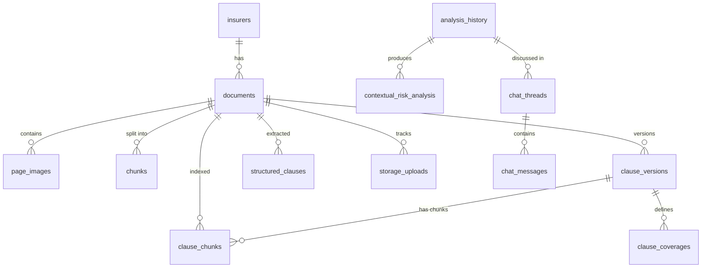

# Database Description — Comparador CSA

> **Scope note:** This description is derived from the Supabase migration history in `server/supabase/migrations/`. Migrations `001` through `028` exist in the repository's last committed state; migrations `029`, `030`, and `031` are not present in git history or the current working tree. The current working tree only retains a rewritten `001_initial_schema.sql`; files `002`–`028` are deleted from the working tree but remain readable from git history.
>
> Migration `001` was rewritten into a single consolidated baseline that already contains the tables, indexes, functions, triggers, and policies that older individual migrations (`008`–`015`, `019`, `027`) originally introduced. Where the consolidated schema and the older per-migration DDL differ, this document describes the **final consolidated state** represented by migration `001` plus the incremental changes in `015b` and `016`–`028`.

---

## 1. Executive Summary

- **Platform:** Supabase (PostgreSQL 15+).
- **Extensions:** `uuid-ossp` and `pgvector` (`vector`).
- **Vector dimension:** 3072 (Gemini embedding models).
- **Total tables:** 21 core tables in the `public` schema, plus 1 auxiliary storage-tracking table (`storage_uploads`).
- **Main functional domains:**
  1. Insurer/document ingestion and page-level storage.
  2. RAG/vector search over quotation and clause chunks.
  3. Structured clause extraction and clause-version management.
  4. Coverage canonicalization and a probabilistic coverage semantic graph.
  5. Insurance-quote comparison analysis and contextual risk scoring.
  6. Per-user client profiles.
  7. Persistent chat threads and messages tied to analyses.
  8. PDF template registry for extraction.
  9. Telemetry, error logging, and audit traces.
- **Data-model purpose:** The database supports an AI assistant that compares commercial insurance quotes against policy clauses (clausulados). It stores raw PDF pages, vector chunks for semantic retrieval, structured JSON extractions, coverage canonicalization mappings, user analyses, and conversational context.

---

## 2. Schema Overview

### 2.1 Insurers & Documents

#### `public.insurers`
| Column | Type | Default / Constraint | Notes |
|--------|------|----------------------|-------|
| `id` | `UUID` | `PRIMARY KEY DEFAULT gen_random_uuid()` | |
| `name` | `TEXT` | `UNIQUE NOT NULL` | Insurer/legal name |
| `nit` | `TEXT` | nullable | Tax ID |
| `contact_email` | `TEXT` | nullable | |
| `phone` | `TEXT` | nullable | |
| `created_at` | `TIMESTAMP WITH TIME ZONE` | `DEFAULT NOW()` | |

#### `public.documents`
| Column | Type | Default / Constraint | Notes |
|--------|------|----------------------|-------|
| `id` | `UUID` | `PRIMARY KEY DEFAULT gen_random_uuid()` | |
| `insurer_id` | `UUID` | `REFERENCES public.insurers(id) ON DELETE CASCADE` | |
| `document_name` | `TEXT` | `NOT NULL` | |
| `document_type` | `TEXT` | `CHECK (document_type IN ('CLAUSULADO_GENERAL', 'CLAUSULADO_PARTICULAR', 'COTIZACION', 'ANEXO'))` | Added `ANEXO` in migration `007` |
| `product_name` | `TEXT` | nullable | Added in migration `007` |
| `version` | `TEXT` | nullable | |
| `total_pages` | `INTEGER` | nullable | |
| `storage_path` | `TEXT` | `NOT NULL` | Supabase Storage path |
| `file_hash` | `TEXT` | nullable | Duplicate detection |
| `is_active` | `BOOLEAN` | `DEFAULT true` | |
| `uploaded_by` | `TEXT` | nullable | User ID or system |
| `created_at` | `TIMESTAMP WITH TIME ZONE` | `DEFAULT NOW()` | |
| `updated_at` | `TIMESTAMP WITH TIME ZONE` | `DEFAULT NOW()` | |

**Constraints:**
- `UNIQUE(insurer_id, document_name, document_type)`
- Partial unique index `documents_unique_active_version` on `(insurer_id, document_type, COALESCE(product_name, '')) WHERE is_active = true` (added in `007`).

#### `public.page_images`
| Column | Type | Default / Constraint | Notes |
|--------|------|----------------------|-------|
| `id` | `UUID` | `PRIMARY KEY DEFAULT gen_random_uuid()` | |
| `document_id` | `UUID` | `REFERENCES public.documents(id) ON DELETE CASCADE` | |
| `page_number` | `INTEGER` | `NOT NULL` | |
| `storage_url` | `TEXT` | `NOT NULL` | Public/private URL |
| `storage_path` | `TEXT` | `NOT NULL` | Bucket path |
| `ocr_text` | `TEXT` | nullable | OCR fallback text |
| `width` | `INTEGER` | nullable | |
| `height` | `INTEGER` | nullable | |
| `created_at` | `TIMESTAMP WITH TIME ZONE` | `DEFAULT NOW()` | |

**Constraint:** `UNIQUE(document_id, page_number)`.

---

### 2.2 Vector Chunks & RAG

#### `public.chunks` — Vector chunks for quotations and general RAG
| Column | Type | Default / Constraint | Notes |
|--------|------|----------------------|-------|
| `id` | `UUID` | `PRIMARY KEY DEFAULT gen_random_uuid()` | |
| `document_id` | `UUID` | `REFERENCES public.documents(id) ON DELETE CASCADE` | |
| `page_number` | `INTEGER` | `NOT NULL` | |
| `content` | `TEXT` | `NOT NULL` | Raw chunk text |
| `content_normalized` | `TEXT` | nullable | Normalized text (lowercase, accents removed) |
| `embedding` | `vector(3072)` | nullable | Gemini embedding |
| `metadata` | `JSONB` | `DEFAULT '{}'` | |
| `coverage_tags` | `TEXT[]` | nullable | Coverage labels for filtering |
| `section_type` | `TEXT` | `CHECK (section_type IN ('COBERTURA', 'EXCLUSION', 'DEDUCIBLE', 'CONDICION', 'GENERAL'))` | |
| `created_at` | `TIMESTAMP WITH TIME ZONE` | `DEFAULT NOW()` | |

**Note:** Migration `017` removed the `ivfflat` vector index on `chunks.embedding` because `ivfflat` supports at most 2000 dimensions; 3072-D search currently uses exact distance scans.

#### `public.clause_chunks` — Clause-specific RAG index
| Column | Type | Default / Constraint | Notes |
|--------|------|----------------------|-------|
| `id` | `UUID` | `PRIMARY KEY DEFAULT gen_random_uuid()` | |
| `document_id` | `UUID` | `REFERENCES public.documents(id) ON DELETE CASCADE` | |
| `clause_version_id` | `UUID` | `REFERENCES public.clause_versions(id) ON DELETE CASCADE` | |
| `chunk_index` | `INTEGER` | `NOT NULL` | |
| `content` | `TEXT` | `NOT NULL` | |
| `embedding` | `vector(3072)` | nullable | |
| `insurer_name` | `TEXT` | `NOT NULL` | |
| `coverage_type` | `TEXT` | nullable | |
| `semantic_tags` | `TEXT[]` | nullable | |
| `product_name` | `TEXT` | nullable | |
| `domain` | `TEXT` | `DEFAULT 'pyme'` | |
| `created_at` | `TIMESTAMP WITH TIME ZONE` | `DEFAULT NOW()` | |

---

### 2.3 Clause Library

#### `public.clause_versions`
| Column | Type | Default / Constraint | Notes |
|--------|------|----------------------|-------|
| `id` | `UUID` | `PRIMARY KEY DEFAULT gen_random_uuid()` | |
| `document_id` | `UUID` | `REFERENCES public.documents(id) ON DELETE CASCADE` | |
| `insurer_name` | `TEXT` | `NOT NULL` | |
| `product_name` | `TEXT` | `NOT NULL` | |
| `version_tag` | `TEXT` | `NOT NULL` | |
| `effective_date` | `DATE` | nullable | |
| `created_at` | `TIMESTAMP WITH TIME ZONE` | `DEFAULT NOW()` | |

**Ambiguity:** The older migration `010` defined a simpler `clause_versions` table with `version_number`, `parent_version_id`, and `change_summary`. Migration `001` (consolidated) redefined it with the columns above.

#### `public.structured_clauses` — Gemini JSON extractions
| Column | Type | Default / Constraint | Notes |
|--------|------|----------------------|-------|
| `id` | `UUID` | `PRIMARY KEY DEFAULT gen_random_uuid()` | |
| `document_id` | `UUID` | `REFERENCES public.documents(id) ON DELETE SET NULL` | |
| `insurer_name` | `TEXT` | `NOT NULL` | |
| `product_name` | `TEXT` | nullable | |
| `document_type` | `TEXT` | nullable | |
| `extracted_data` | `JSONB` | `NOT NULL` | Structured clause JSON |
| `raw_text` | `TEXT` | nullable | |
| `page_count` | `INTEGER` | nullable | |
| `domain` | `TEXT` | `DEFAULT 'pyme'` | Added in `018` |
| `created_at` | `TIMESTAMP WITH TIME ZONE` | `DEFAULT NOW()` | |
| `updated_at` | `TIMESTAMP WITH TIME ZONE` | `DEFAULT NOW()` | |

#### `public.clause_coverages`
| Column | Type | Default / Constraint | Notes |
|--------|------|----------------------|-------|
| `id` | `UUID` | `PRIMARY KEY DEFAULT gen_random_uuid()` | |
| `clause_version_id` | `UUID` | `REFERENCES public.clause_versions(id) ON DELETE CASCADE` | |
| `coverage_name` | `TEXT` | `NOT NULL` | |
| `coverage_type` | `TEXT` | nullable | |
| `limit_amount` | `NUMERIC` | nullable | |
| `deductible_text` | `TEXT` | nullable | |
| `created_at` | `TIMESTAMP WITH TIME ZONE` | `DEFAULT NOW()` | |

**Ambiguity:** Migration `009` originally created `clause_coverages` with `document_id UUID`, `is_mandatory BOOLEAN`, `exclusions TEXT[]`, `conditions TEXT[]`, `page_number INTEGER`, and `extracted_at TIMESTAMPTZ`. Migration `001` redefined the table to the schema above.

---

### 2.4 Analysis, Client Profiles & Risk

#### `public.analysis_history`
| Column | Type | Default / Constraint | Notes |
|--------|------|----------------------|-------|
| `id` | `UUID` | `PRIMARY KEY DEFAULT gen_random_uuid()` | |
| `user_id` | `TEXT` | nullable | Supabase user ID or override |
| `client_name` | `TEXT` | `NOT NULL` | |
| `quote_document_ids` | `UUID[]` | nullable | Added/made UUID[] in `001`/`026` |
| `clause_document_ids` | `UUID[]` | nullable | Added in `001`/`026` |
| `analysis_result` | `JSONB` | `NOT NULL` | Full comparison result |
| `recommendation` | `TEXT` | nullable | |
| `total_score` | `INTEGER` | nullable | Consolidated `001` uses `INTEGER`; migration `005` used `NUMERIC` |
| `correlation_id` | `TEXT` | nullable | Added in `020`/`026` |
| `created_at` | `TIMESTAMP WITH TIME ZONE` | `DEFAULT NOW()` | |

**Ambiguity:** Migration `005` created `analysis_history` with `quote_document_ids TEXT[]`, `clause_document_ids TEXT[]`, and `total_score NUMERIC`. Migration `001` (and `026`) reconciled `quote_document_ids`/`clause_document_ids` to `UUID[]` and `total_score` to `INTEGER`.

**Columns added in `006`:**
- `extraction_confidence INTEGER`
- `needs_review BOOLEAN DEFAULT FALSE`
- `validation_flags_count INTEGER DEFAULT 0`

#### `public.contextual_risk_analysis`
| Column | Type | Default / Constraint | Notes |
|--------|------|----------------------|-------|
| `id` | `UUID` | `PRIMARY KEY DEFAULT gen_random_uuid()` | |
| `analysis_history_id` | `UUID` | `REFERENCES public.analysis_history(id) ON DELETE CASCADE` | |
| `coverage_name` | `TEXT` | `NOT NULL` | |
| `risk_type` | `TEXT` | `NOT NULL` | |
| `risk_level` | `TEXT` | `NOT NULL` | |
| `explanation` | `TEXT` | nullable | |
| `mitigation_suggestion` | `TEXT` | nullable | |
| `created_at` | `TIMESTAMP WITH TIME ZONE` | `DEFAULT NOW()` | |

#### `public.client_profiles`
| Column | Type | Default / Constraint | Notes |
|--------|------|----------------------|-------|
| `id` | `UUID` | `PRIMARY KEY DEFAULT gen_random_uuid()` | |
| `user_id` | `TEXT` | nullable | Added in `021`/`026` |
| `client_name` | `TEXT` | `NOT NULL` | Added in `021`/`026` |
| `primary_activity` | `TEXT` | nullable | |
| `annual_revenue` | `BIGINT` | nullable | |
| `employee_count` | `INTEGER` | nullable | |
| `building_type` | `TEXT` | nullable | |
| `has_single_supplier` | `BOOLEAN` | nullable | |
| `raw_client_data` | `JSONB` | nullable | Added in `021`/`026` |
| `created_at` | `TIMESTAMP WITH TIME ZONE` | `DEFAULT NOW()` | |
| `updated_at` | `TIMESTAMP WITH TIME ZONE` | `DEFAULT NOW()` | |

**Ambiguity:** Migration `008` originally created `client_profiles` with `client_id UUID`, `industry_type TEXT` (check constraint), `location_city TEXT`, `location_zone TEXT` (check constraint), and `building_type TEXT` (check constraint). Migration `001`/`021`/`026` redefined the table to the schema above; the original check constraints no longer exist.

---

### 2.5 Chat System

#### `public.chat_threads`
| Column | Type | Default / Constraint | Notes |
|--------|------|----------------------|-------|
| `id` | `UUID` | `PRIMARY KEY DEFAULT gen_random_uuid()` | |
| `user_id` | `TEXT` | `NOT NULL` | |
| `title` | `TEXT` | `NOT NULL DEFAULT 'Nueva Consulta'` | |
| `report_id` | `UUID` | `REFERENCES public.analysis_history(id) ON DELETE SET NULL` | |
| `client_name` | `TEXT` | nullable | Added in `015b` |
| `insurer_names` | `TEXT[]` | nullable | Added in `015b` |
| `status` | `TEXT` | `DEFAULT 'active'` | Added in `015b` |
| `context_summary` | `TEXT` | nullable | Added in `015b` |
| `created_at` | `TIMESTAMP WITH TIME ZONE` | `DEFAULT NOW()` | |
| `updated_at` | `TIMESTAMP WITH TIME ZONE` | `DEFAULT NOW()` | |

#### `public.chat_messages`
| Column | Type | Default / Constraint | Notes |
|--------|------|----------------------|-------|
| `id` | `UUID` | `PRIMARY KEY DEFAULT gen_random_uuid()` | |
| `thread_id` | `UUID` | `NOT NULL REFERENCES public.chat_threads(id) ON DELETE CASCADE` | |
| `role` | `TEXT` | `NOT NULL CHECK (role IN ('user', 'model', 'system'))` | `015b` changed `'assistant'` to `'model'` |
| `content` | `TEXT` | `NOT NULL` | |
| `sources` | `JSONB` | nullable | |
| `sources_used` | `JSONB` | `DEFAULT '[]'` | Added in `015b` |
| `confidence_score` | `DOUBLE PRECISION` | nullable | |
| `tokens_input` | `INTEGER` | nullable | Added in `015b` |
| `tokens_output` | `INTEGER` | nullable | Added in `015b` |
| `latency_ms` | `INTEGER` | nullable | Added in `015b` |
| `created_at` | `TIMESTAMP WITH TIME ZONE` | `DEFAULT NOW()` | |

---

### 2.6 Coverage Mapping & Semantic Graph

#### `public.coverage_mappings` — Learning engine for raw-name → canonical-name
| Column | Type | Default / Constraint | Notes |
|--------|------|----------------------|-------|
| `id` | `UUID` | `PRIMARY KEY DEFAULT gen_random_uuid()` | |
| `raw_name` | `TEXT` | `NOT NULL` | |
| `insurer_name` | `TEXT` | nullable | |
| `canonical_name` | `TEXT` | `NOT NULL` | |
| `semantic_tags` | `TEXT[]` | nullable | |
| `confidence` | `DOUBLE PRECISION` | `DEFAULT 1.0` | |
| `is_composite` | `BOOLEAN` | `DEFAULT false` | |
| `components` | `TEXT[]` | nullable | |
| `user_corrected` | `BOOLEAN` | `DEFAULT false` | |
| `correction_count` | `INTEGER` | `DEFAULT 0` | |
| `raw_text_snippet` | `TEXT` | nullable | Added in `016` |
| `ai_justification` | `TEXT` | nullable | Added in `016` |
| `page_number` | `INTEGER` | nullable | Added in `016` |
| `needs_human_review` | `BOOLEAN` | `DEFAULT false` | Added in `016` |
| `embedding` | `vector(3072)` | nullable | Added in `016` |
| `domain` | `TEXT` | `DEFAULT 'pyme'` | Added in `018` |
| `last_used_at` | `TIMESTAMP WITH TIME ZONE` | `DEFAULT NOW()` | |
| `created_at` | `TIMESTAMP WITH TIME ZONE` | `DEFAULT NOW()` | |
| `updated_at` | `TIMESTAMP WITH TIME ZONE` | `DEFAULT NOW()` | |

**Unique index:** `idx_coverage_mappings_domain_unique` on `(domain, COALESCE(insurer_name, ''), raw_name)` (added in `022`/`022b`).

#### `public.coverage_graph_edges` — Probabilistic coverage relationships
| Column | Type | Default / Constraint | Notes |
|--------|------|----------------------|-------|
| `id` | `UUID` | `PRIMARY KEY DEFAULT gen_random_uuid()` | |
| `from_node` | `TEXT` | `NOT NULL` | |
| `to_node` | `TEXT` | `NOT NULL` | |
| `edge_type` | `TEXT` | `NOT NULL` | |
| `weight` | `DOUBLE PRECISION` | `DEFAULT 1.0` | |
| `insurer` | `TEXT` | nullable | |
| `correction_count` | `INTEGER` | `DEFAULT 0` | |
| `domain` | `TEXT` | `DEFAULT 'pyme'` | |
| `created_at` | `TIMESTAMP WITH TIME ZONE` | `DEFAULT NOW()` | |
| `updated_at` | `TIMESTAMP WITH TIME ZONE` | `DEFAULT NOW()` | |

**Unique index:** `idx_coverage_graph_edges_unique` on `(from_node, to_node, edge_type, insurer, domain)` (added in `019`).

#### `public.deductible_benchmarks`
| Column | Type | Default / Constraint | Notes |
|--------|------|----------------------|-------|
| `id` | `UUID` | `PRIMARY KEY DEFAULT gen_random_uuid()` | |
| `coverage_type` | `TEXT` | `NOT NULL` | |
| `benchmark_name` | `TEXT` | `NOT NULL` | e.g. `excellent`, `standard`, `poor` |
| `benchmark_data` | `JSONB` | `NOT NULL` | |
| `market_region` | `TEXT` | `DEFAULT 'CO'` | Consolidated `001`; migration `013` used `'Colombia'` |
| `effective_date` | `DATE` | nullable | |
| `notes` | `TEXT` | nullable | |
| `created_at` | `TIMESTAMP WITH TIME ZONE` | `DEFAULT NOW()` | |

**Unique index:** `idx_deductible_benchmarks_unique` on `(coverage_type, benchmark_name)`.

---

### 2.7 Embeddings Cache & Template Registry

#### `public.coverage_embeddings_cache`
| Column | Type | Default / Constraint | Notes |
|--------|------|----------------------|-------|
| `id` | `SERIAL` | `PRIMARY KEY` | |
| `coverage_name` | `TEXT` | `NOT NULL` | |
| `embedding` | `JSONB` | `NOT NULL` | Stored as JSON array, not `vector` |
| `model` | `TEXT` | `NOT NULL` | |
| `dimensions` | `INTEGER` | `NOT NULL` | |
| `created_at` | `TIMESTAMP WITH TIME ZONE` | `DEFAULT NOW()` | |
| `updated_at` | `TIMESTAMP WITH TIME ZONE` | `DEFAULT NOW()` | |

**Unique constraint:** `(coverage_name, model)`.

#### `public.template_registry`
| Column | Type | Default / Constraint | Notes |
|--------|------|----------------------|-------|
| `id` | `UUID` | `PRIMARY KEY DEFAULT gen_random_uuid()` | |
| `template_id` | `TEXT` | `NOT NULL` | Business key |
| `insurer` | `TEXT` | `NOT NULL` | |
| `display_name` | `TEXT` | `NOT NULL` | |
| `version` | `INTEGER` | `DEFAULT 1` | |
| `fingerprints` | `JSONB` | `NOT NULL` | |
| `schema` | `JSONB` | `NOT NULL` | Extraction JSON schema |
| `hints` | `JSONB` | `DEFAULT '{}'` | |
| `prompt_addon` | `TEXT` | `DEFAULT ''` | |
| `is_active` | `BOOLEAN` | `DEFAULT true` | |
| `domain` | `TEXT` | `DEFAULT 'pyme'` | |
| `created_at` | `TIMESTAMP WITH TIME ZONE` | `DEFAULT NOW()` | |
| `updated_at` | `TIMESTAMP WITH TIME ZONE` | `DEFAULT NOW()` | |

**Ambiguity:** Migration `019` declared `template_id TEXT NOT NULL UNIQUE`, `version INTEGER NOT NULL DEFAULT 1`, `fingerprints/schema/hints JSONB NOT NULL DEFAULT '{}'::jsonb`, `prompt_addon TEXT NOT NULL DEFAULT ''`, `is_active BOOLEAN NOT NULL DEFAULT TRUE`, `domain TEXT NOT NULL DEFAULT 'pyme'`, and `created_at/updated_at TIMESTAMPTZ NOT NULL DEFAULT NOW()`. Migration `001` relaxed several of those `NOT NULL`/`NOT NULL DEFAULT` constraints while keeping the same columns.

---

### 2.8 Telemetry, Errors & Storage Tracking

#### `public.analysis_logs`
| Column | Type | Default / Constraint | Notes |
|--------|------|----------------------|-------|
| `id` | `UUID` | `PRIMARY KEY DEFAULT gen_random_uuid()` | |
| `analysis_id` | `TEXT` | nullable | |
| `duration_ms` | `INTEGER` | `NOT NULL` | |
| `status` | `TEXT` | `NOT NULL CHECK (status IN ('success', 'error'))` | |
| `error_type` | `TEXT` | nullable | |
| `created_at` | `TIMESTAMP WITH TIME ZONE` | `DEFAULT NOW()` | |

#### `public.unified_engine_errors`
| Column | Type | Default / Constraint | Notes |
|--------|------|----------------------|-------|
| `id` | `UUID` | `PRIMARY KEY DEFAULT gen_random_uuid()` | |
| `correlation_id` | `TEXT` | nullable | |
| `category` | `TEXT` | `NOT NULL` | |
| `error_code` | `TEXT` | nullable | |
| `error_message` | `TEXT` | `NOT NULL` | |
| `stack_trace` | `TEXT` | nullable | |
| `metadata` | `JSONB` | nullable | |
| `resolved` | `BOOLEAN` | `DEFAULT false` | |
| `created_at` | `TIMESTAMP WITH TIME ZONE` | `DEFAULT NOW()` | |

#### `public.storage_uploads` — Auxiliary upload-tracking table
| Column | Type | Default / Constraint | Notes |
|--------|------|----------------------|-------|
| `id` | `UUID` | `PRIMARY KEY DEFAULT uuid_generate_v4()` | |
| `document_id` | `UUID` | `REFERENCES documents(id) ON DELETE CASCADE` | |
| `file_path` | `TEXT` | `NOT NULL` | |
| `file_size` | `INTEGER` | nullable | |
| `upload_status` | `TEXT` | `CHECK (upload_status IN ('PENDING', 'COMPLETED', 'FAILED'))` | |
| `error_message` | `TEXT` | nullable | |
| `created_at` | `TIMESTAMP WITH TIME ZONE` | `DEFAULT NOW()` | |
| `completed_at` | `TIMESTAMP WITH TIME ZONE` | nullable | |

---

## 3. Relationships

### Foreign Keys

| Source Table | Source Column(s) | Target Table | Target Column | ON DELETE |
|--------------|------------------|--------------|---------------|-----------|
| `documents` | `insurer_id` | `insurers` | `id` | `CASCADE` |
| `page_images` | `document_id` | `documents` | `id` | `CASCADE` |
| `chunks` | `document_id` | `documents` | `id` | `CASCADE` |
| `clause_versions` | `document_id` | `documents` | `id` | `CASCADE` |
| `clause_chunks` | `document_id` | `documents` | `id` | `CASCADE` |
| `clause_chunks` | `clause_version_id` | `clause_versions` | `id` | `CASCADE` |
| `structured_clauses` | `document_id` | `documents` | `id` | `SET NULL` |
| `clause_coverages` | `clause_version_id` | `clause_versions` | `id` | `CASCADE` |
| `contextual_risk_analysis` | `analysis_history_id` | `analysis_history` | `id` | `CASCADE` |
| `chat_threads` | `report_id` | `analysis_history` | `id` | `SET NULL` |
| `chat_messages` | `thread_id` | `chat_threads` | `id` | `CASCADE` |
| `storage_uploads` | `document_id` | `documents` | `id` | `CASCADE` |

**Note:** `coverage_graph_edges`, `coverage_mappings`, `deductible_benchmarks`, `template_registry`, `coverage_embeddings_cache`, `analysis_logs`, and `unified_engine_errors` have no foreign keys.

### ER Diagram (Mermaid)



---

## 4. Indexes

### Primary-key indexes (implicit)
All tables have a primary-key index on their `id` column (or `id SERIAL` for `coverage_embeddings_cache`).

### Per-table secondary indexes

#### `chunks`
- `idx_chunks_document_type` — `(document_id, section_type)`
- `idx_chunks_coverage_tags` — `GIN(coverage_tags)`
- `idx_chunks_document_type` (from migration `012`) — `(document_id)` — **Note:** same name, different definition in `012` vs `001`; final state depends on apply order.

#### `clause_chunks`
- `idx_clause_chunks_document` — `(document_id)`
- `idx_clause_chunks_version` — `(clause_version_id)`
- `idx_clause_chunks_coverage` — `(coverage_type)`

#### `clause_coverages`
- `idx_clause_coverages_document` — `(document_id)` (older migration `009`; table was redefined)
- `idx_clause_coverages_name` — `(coverage_name)` (older migration `009`)

#### `clause_versions`
- `idx_clause_versions_document` — `(document_id)` (older migration `010`; table was redefined)

#### `documents`
- `idx_documents_insurer` — `(insurer_id)`
- `idx_documents_active` — `(is_active) WHERE is_active = true` (partial)
- `idx_documents_product` — `(product_name)` (added in `007`)
- `idx_documents_version` — `(insurer_id, document_type, product_name, is_active)` (added in `007`)
- `documents_unique_active_version` — `UNIQUE (insurer_id, document_type, COALESCE(product_name, '')) WHERE is_active = true` (added in `007`)

#### `page_images`
- `idx_page_images_document` — `(document_id)`

#### `structured_clauses`
- `idx_structured_clauses_insurer` — `(insurer_name)`
- `idx_structured_clauses_document` — `(document_id)`
- `idx_structured_clauses_data_gin` — `GIN (extracted_data jsonb_path_ops)` (added in `013`)
- `idx_structured_clauses_type` — `(document_type)` (added in `013`)
- `idx_structured_clauses_insurer_type` — `(insurer_name, document_type)` (added in `013`)
- `idx_structured_clauses_raw_text` — `GIN(to_tsvector('spanish', COALESCE(raw_text, '')))` (added in `013`)
- `idx_structured_clauses_particular` — `(insurer_name, product_name) WHERE document_type = 'CLAUSULADO_PARTICULAR'` (partial, added in `013`)
- `idx_structured_clauses_domain` — `(domain)` (added in `018`)
- `idx_structured_clauses_domain_insurer` — `(domain, insurer_name)` (added in `018`)

#### `analysis_history`
- `idx_analysis_history_user_id` — `(user_id)`
- `idx_analysis_history_correlation` — `(correlation_id)`
- `idx_analysis_history_created_at` — `(created_at DESC)` (added in `005`)
- `idx_analysis_history_user_created` — `(user_id, created_at DESC)` (added in `005`)
- `idx_analysis_history_correlation_id` — `(correlation_id)` (added in `020`/`026`)

#### `contextual_risk_analysis`
- `idx_contextual_risk_analysis_history` — `(analysis_history_id)` (added in `011`)

#### `client_profiles`
- `idx_client_profiles_client` — `(client_id)` (older migration `008`; column was later removed)

#### `chat_threads`
- `idx_chat_threads_user` — `(user_id)`
- `idx_chat_threads_report` — `(report_id) WHERE report_id IS NOT NULL` (partial, added in `015`)
- `idx_chat_threads_status` — `(status) WHERE status = 'active'` (partial, added in `015`/`015b`)

#### `chat_messages`
- `idx_chat_messages_thread` — `(thread_id)`
- `idx_chat_messages_created` — `(created_at)` (added in `015`/`015b`)

#### `coverage_mappings`
- `idx_coverage_mappings_raw` — `(raw_name)`
- `idx_coverage_mappings_canonical` — `(canonical_name)`
- `idx_coverage_mappings_raw_name` — `(raw_name)` (added in `013`)
- `idx_coverage_mappings_corrected` — `(user_corrected) WHERE user_corrected = TRUE` (partial, added in `013`)
- `idx_coverage_mappings_needs_human_review` — `(needs_human_review) WHERE needs_human_review = TRUE` (partial, added in `018`)
- `idx_coverage_mappings_domain` — `(domain)` (added in `018`)
- `idx_coverage_mappings_domain_insurer` — `(domain, insurer_name)` (added in `018`)
- `idx_coverage_mappings_domain_unique` — `UNIQUE (domain, COALESCE(insurer_name, ''), raw_name)` (added in `022`/`022b`)

#### `coverage_graph_edges`
- `idx_coverage_graph_from` — `(from_node)`
- `idx_coverage_graph_to` — `(to_node)`
- `idx_coverage_graph_edges_lookup` — `(from_node, edge_type, domain)` (added in `019`)
- `idx_coverage_graph_edges_to_node` — `(to_node, edge_type, domain)` (added in `019`)
- `idx_coverage_graph_edges_insurer` — `(insurer, domain)` (added in `019`)
- `idx_coverage_graph_edges_unique` — `UNIQUE (from_node, to_node, edge_type, insurer, domain)` (added in `019`)

#### `coverage_embeddings_cache`
- `idx_coverage_embeddings_name` — `(coverage_name)`
- `idx_coverage_embeddings_model` — `(model)`
- `unique_coverage_embedding` — `UNIQUE (coverage_name, model)`

#### `deductible_benchmarks`
- `idx_deductible_benchmarks_unique` — `UNIQUE (coverage_type, benchmark_name)`

#### `template_registry`
- `idx_template_registry_template_id` — `(template_id)`
- `idx_template_registry_domain_insurer` — `(domain, insurer)`
- `idx_template_registry_active_domain` — `(domain, is_active)`

#### `analysis_logs`
- `idx_analysis_logs_status` — `(status)`
- `idx_analysis_logs_created_at` — `(created_at DESC)` (added in `027`)
- `idx_analysis_logs_analysis_id` — `(analysis_id)` (added in `027`)

#### `unified_engine_errors`
- `idx_unified_engine_errors_category` — `(category)`
- `idx_unified_engine_errors_created_at` — `(created_at DESC)` (added in `027`)
- `idx_unified_engine_errors_correlation_id` — `(correlation_id)` (added in `027`)

#### `storage_uploads`
- `idx_storage_uploads_document` — `(document_id)`

---

## 5. Functions / RPCs

### Updated-at trigger helper
```sql
public.update_updated_at_column()
RETURNS TRIGGER
```
Sets `NEW.updated_at = NOW()`.

### RAG search functions

#### `public.match_chunks_unified`
```sql
public.match_chunks_unified(
  query_embedding vector(3072),
  match_count INT DEFAULT 5,
  filter_insurer_id UUID DEFAULT NULL,
  filter_coverage TEXT DEFAULT NULL,
  filter_document_id UUID DEFAULT NULL
)
RETURNS TABLE (
  id UUID,
  document_id UUID,
  page_number INT,
  content TEXT,
  similarity FLOAT,
  metadata JSONB,
  coverage_tags TEXT[]
)
```
Vector similarity search over `chunks`, filtered by active documents, insurer, coverage tag, and/or document. Returns cosine-similarity score.

**Note:** Migration `012` originally defined a hybrid (vector + full-text) version of `match_chunks_unified` with different parameters and a `query_text text` argument. Migration `001` redefined it to the vector-only signature above.

#### `public.match_chunks_vector_unified`
```sql
public.match_chunks_vector_unified(
  query_embedding vector(3072),
  insurer_filter text DEFAULT NULL,
  coverage_filter text[] DEFAULT NULL,
  match_count int DEFAULT 5
)
RETURNS TABLE (
  id uuid,
  document_id uuid,
  insurer_name text,
  section_type text,
  coverage_tags text[],
  content text,
  page_number int,
  similarity float
)
```
Vector-only clause search over `chunks` filtered to `CLAUSULADO_*` document types (added in `012`).

#### `public.match_chunks_hybrid`
```sql
public.match_chunks_hybrid(
  query_embedding VECTOR(3072),
  query_text TEXT,
  insurer_filter TEXT DEFAULT NULL,
  coverage_filter TEXT[] DEFAULT NULL,
  section_filter TEXT DEFAULT NULL,
  match_count INT DEFAULT 10,
  vector_weight FLOAT DEFAULT 0.7,
  text_weight FLOAT DEFAULT 0.3
)
RETURNS TABLE (
  id UUID,
  document_id UUID,
  insurer_name TEXT,
  section_type TEXT,
  coverage_tags TEXT[],
  content TEXT,
  page_number INT,
  vector_similarity FLOAT,
  text_rank FLOAT,
  combined_score FLOAT
)
```
Hybrid search over `clause_chunks` combining vector similarity and Spanish full-text rank (added in `013`).

#### `public.search_structured_clauses`
```sql
public.search_structured_clauses(
  p_insurer_name TEXT DEFAULT NULL,
  p_coverage_name TEXT DEFAULT NULL,
  p_field_type TEXT DEFAULT NULL,
  match_count INT DEFAULT 10,
  p_domain TEXT DEFAULT NULL
)
RETURNS TABLE (
  id UUID,
  insurer_name TEXT,
  product_name TEXT,
  document_type TEXT,
  coverage_data JSONB,
  page_number INT,
  relevance FLOAT
)
```
Searches `structured_clauses.extracted_data` by insurer, coverage name regex, field presence, and domain (domain parameter added in `028`).

#### `public.search_chunks_by_coverage`
```sql
public.search_chunks_by_coverage(
  p_embedding vector(3072),
  p_insurer_id UUID,
  p_coverage_tag TEXT DEFAULT NULL,
  p_match_count INTEGER DEFAULT 5
)
RETURNS TABLE(
  id UUID,
  content TEXT,
  page_number INTEGER,
  document_id UUID,
  document_type TEXT,
  document_name TEXT,
  similarity FLOAT
)
```
Vector search filtered to one insurer and optionally one coverage tag (added in `002`, recreated with `3072` dims in `004`).

#### `public.search_chunks_advanced`
```sql
public.search_chunks_advanced(
  p_embedding vector(3072),
  p_insurer_id UUID,
  p_coverage_tags TEXT[] DEFAULT NULL,
  p_section_types TEXT[] DEFAULT NULL,
  p_document_types TEXT[] DEFAULT NULL,
  p_match_count INTEGER DEFAULT 5,
  p_min_similarity FLOAT DEFAULT 0.7
)
RETURNS TABLE(
  id UUID,
  content TEXT,
  page_number INTEGER,
  document_id UUID,
  document_name TEXT,
  document_type TEXT,
  section_type TEXT,
  coverage_tags TEXT[],
  similarity FLOAT
)
```
Vector search with multiple array filters and minimum similarity threshold (added in `002`, recreated in `004`).

#### `public.get_chunks_by_coverage_unified`
```sql
public.get_chunks_by_coverage_unified(
  coverage_name text,
  insurer_filter text DEFAULT NULL,
  section_filter text DEFAULT NULL,
  match_count int DEFAULT 3
)
RETURNS TABLE (
  id uuid,
  document_id uuid,
  insurer_name text,
  section_type text,
  coverage_tags text[],
  content text,
  page_number int
)
```
Exact coverage-tag lookup over `chunks` for clause documents (added in `012`).

### Validation / utility functions

#### `public.validate_quote_coverage`
```sql
public.validate_quote_coverage(
  p_quote_document_id UUID,
  p_clause_document_id UUID,
  p_coverage_tag TEXT,
  p_match_count INTEGER DEFAULT 3
)
RETURNS TABLE(
  quote_chunk_id UUID,
  quote_content TEXT,
  quote_page INTEGER,
  clause_chunk_id UUID,
  clause_content TEXT,
  clause_page INTEGER,
  similarity FLOAT
)
```
Finds the most representative quote chunk for a coverage tag and returns the closest matching clause chunks (added in `002`, recreated in `004`).

#### `public.get_chunks_with_images`
```sql
public.get_chunks_with_images(
  p_chunk_ids UUID[]
)
RETURNS TABLE(
  chunk_id UUID,
  content TEXT,
  page_number INTEGER,
  document_id UUID,
  document_name TEXT,
  image_url TEXT,
  image_path TEXT
)
```
Resolves chunks to their page images (added in `002`).

#### `public.list_documents_by_insurer`
```sql
public.list_documents_by_insurer(
  p_insurer_id UUID,
  p_document_type TEXT DEFAULT NULL
)
RETURNS TABLE(
  document_id UUID,
  document_name TEXT,
  document_type TEXT,
  version TEXT,
  total_pages INTEGER,
  chunk_count BIGINT,
  is_active BOOLEAN,
  created_at TIMESTAMP WITH TIME ZONE
)
```
Lists documents per insurer with chunk counts (added in `002`).

#### `public.delete_document_complete`
```sql
public.delete_document_complete(
  p_document_id UUID
)
RETURNS BOOLEAN
```
Deletes a document; dependent chunks and page images are removed by `ON DELETE CASCADE` (added in `002`).

### Structured-clause helpers

#### `public.get_clause_deductible`
```sql
public.get_clause_deductible(
  p_insurer_name TEXT,
  p_coverage_name TEXT
)
RETURNS TABLE (
  coverage_name TEXT,
  deductible JSONB,
  exclusions TEXT[],
  conditions TEXT[],
  page_number INT
)
```
Extracts deductible, exclusions, conditions, and page number from `structured_clauses.extracted_data->coverages` (added in `013`).

#### `public.expand_search_query`
```sql
public.expand_search_query(
  p_query TEXT,
  p_thesaurus JSONB DEFAULT '{}'
)
RETURNS TABLE (
  expanded_query TEXT,
  query_type TEXT
)
```
Returns original query plus synonyms/related terms from a JSON thesaurus (added in `013`).

### Legacy functions referenced but not created in surviving migrations
Migration `024` pins `search_path` for a number of legacy functions that are not defined in the surviving migrations, including:
- `match_clauses(vector(768), text, text, text[], text, integer)`
- `match_clauses_vector(vector(768), text, text[], integer)`
- `get_clauses_by_coverage(text, text, text, integer)`
- `normalize_clause_content()`
- `index_document_transaction(uuid, text, text, text, integer, text, text, jsonb, jsonb, text)`

These appear to be from an earlier clause-chunk architecture using 768-dimensional embeddings and were likely superseded by the 3072-D `chunks`/`clause_chunks` design.

---

## 6. RLS Policies

RLS is enabled on all core tables. The policies below reflect the final consolidated state in migration `001` plus migration `021`.

### Public read (anonymous/authenticated can select)

| Table | Policy | Operation |
|-------|--------|-----------|
| `insurers` | `Public read insurers` / `Allow select for insurers` | `SELECT` |
| `documents` | `Public read documents` / `Allow select for documents` | `SELECT` |
| `page_images` | `Public read page_images` / `Allow select for page_images` | `SELECT` |
| `chunks` | `Public read chunks` / `Allow select for chunks` | `SELECT` |
| `clause_versions` | `Public read clause_versions` / `Allow select for clause_versions` | `SELECT` |
| `clause_chunks` | `Public read clause_chunks` / `Allow select for clause_chunks` | `SELECT` |
| `structured_clauses` | `Public read structured_clauses` / `Allow select for structured_clauses` | `SELECT` |
| `clause_coverages` | `Public read clause_coverages` / `Allow select for clause_coverages` | `SELECT` |
| `coverage_mappings` | `Public read coverage_mappings` / `Allow select for coverage_mappings` | `SELECT` |
| `deductible_benchmarks` | `Allow select for deductible_benchmarks` | `SELECT` |
| `coverage_embeddings_cache` | `Allow select for coverage_embeddings_cache` | `SELECT` |
| `template_registry` | `Public read template_registry` | `SELECT` |

### User-scoped tables

The application identifies the current user through either `auth.uid()::text` or `current_setting('app.current_user_id', true)`.

#### `analysis_history`
- `Users can view own analysis history` — `SELECT`
- `Users can insert own analysis history` — `INSERT`

#### `client_profiles`
- `Users can select own client profiles` — `SELECT`
- `Users can insert own client profiles` — `INSERT`
- `Users can update own client profiles` — `UPDATE`
- `Users can delete own client profiles` — `DELETE`

#### `chat_threads`
- `Users can select own chat threads` — `SELECT`
- `Users can insert own chat threads` — `INSERT`
- `Users can update own chat threads` — `UPDATE`
- `Users can delete own chat threads` — `DELETE`

#### `chat_messages`
- `Users can select own chat messages` — `SELECT`
- `Users can insert own chat messages` — `INSERT`
- `Users can update own chat messages` — `UPDATE`
- `Users can delete own chat messages` — `DELETE`

All four policies use an `EXISTS` subquery against `chat_threads` to ensure the requesting user owns the parent thread.

#### `contextual_risk_analysis`
Migration `021` added two policies that use an `EXISTS` subquery against `analysis_history`:
- `Users can select own contextual risk analysis` — `SELECT`
- `Users can insert own contextual risk analysis` — `INSERT`

#### `template_registry` and `coverage_graph_edges`
Migration `023` enables RLS but creates **no policies**; the backend is expected to access these tables exclusively via service-role.

#### `analysis_logs` and `unified_engine_errors`
RLS is enabled in migration `027`, but no policies are defined in the surviving migrations.

---

## 7. Triggers

| Trigger | Table | Timing | Function |
|---------|-------|--------|----------|
| `update_documents_updated_at` | `documents` | `BEFORE UPDATE` | `public.update_updated_at_column()` |
| `update_structured_clauses_updated_at` | `structured_clauses` | `BEFORE UPDATE` | `public.update_updated_at_column()` |
| `update_client_profiles_updated_at` | `client_profiles` | `BEFORE UPDATE` | `public.update_updated_at_column()` |
| `update_coverage_mappings_updated_at` | `coverage_mappings` | `BEFORE UPDATE` | `public.update_updated_at_column()` |
| `update_template_registry_updated_at` | `template_registry` | `BEFORE UPDATE` | `public.update_updated_at_column()` |
| `update_chat_threads_updated_at` | `chat_threads` | `BEFORE UPDATE` | `public.update_updated_at_column()` |
| `update_coverage_embeddings_updated_at` | `coverage_embeddings_cache` | `BEFORE UPDATE` | `public.update_updated_at_column()` |

**Note:** Older migrations (`008`, `013`, `014`, `015`) created similar triggers for `client_profiles`, `structured_clauses`, `coverage_mappings`, and `coverage_embeddings_cache`; the consolidated `001` schema covers the first five tables in the list above, and `015`/`014` add the chat and embeddings-cache triggers.

---

## 8. Views / Materialized Views

### `public.document_insurer_view`
`CREATE OR REPLACE VIEW` with `security_invoker = true` (migration `025`; also present in `001`).

Columns:
- `document_id` (UUID)
- `document_name` (TEXT)
- `document_type` (TEXT)
- `version` (TEXT)
- `total_pages` (INTEGER)
- `storage_path` (TEXT)
- `is_active` (BOOLEAN)
- `created_at` (TIMESTAMPTZ)
- `updated_at` (TIMESTAMPTZ)
- `uploaded_by` (TEXT)
- `file_hash` (TEXT)
- `insurer_name` (TEXT)
- `insurer_id` (UUID) — added in migration `025`

Definition: `LEFT JOIN` / `JOIN` from `public.documents` to `public.insurers` on `documents.insurer_id = insurers.id`.

No materialized views were found.

---

## 9. Notable Patterns

### 9.1 Vector embeddings
- All semantic-search tables use **3072-dimensional `vector`** columns (Gemini embedding-001 / Gemini 2.5 / 3).
- `chunks.embedding`, `clause_chunks.embedding`, and `coverage_mappings.embedding` are all `vector(3072)`.
- `coverage_embeddings_cache.embedding` is stored as `JSONB` (array of floats), not as a `vector`, to avoid dimension coupling and enable cross-model caching.
- **No vector index is used for 3072-D columns.** Migrations `004`, `016`, and `017` explicitly removed or avoided `ivfflat` indexes because `ivfflat` is limited to 2000 dimensions. Searches run as exact distance scans.

### 9.2 JSONB usage
- `chunks.metadata`, `structured_clauses.extracted_data`, `coverage_mappings.components`/`semantic_tags`, `template_registry.fingerprints/schema/hints`, `deductible_benchmarks.benchmark_data`, `unified_engine_errors.metadata`, and `chat_messages.sources`/`sources_used` all use `JSONB`.
- `analysis_history.analysis_result` stores the full comparison output as `JSONB`.
- `client_profiles.raw_client_data` stores unprocessed client input.

### 9.3 Domain scoping
- A `domain TEXT DEFAULT 'pyme'` column appears on `clause_chunks`, `structured_clauses`, `coverage_mappings`, `coverage_graph_edges`, and `template_registry`.
- Migration `022` enforces a domain-scoped unique index on `coverage_mappings(domain, COALESCE(insurer_name, ''), raw_name)`.
- `search_structured_clauses` accepts an optional `p_domain` parameter (added in `028`).

### 9.4 Versioning and active-document control
- `documents` has `is_active BOOLEAN DEFAULT true`, `version`, and `product_name`.
- A partial unique index prevents more than one active document per `(insurer_id, document_type, COALESCE(product_name, ''))`.
- `clause_versions` tracks insurer/product/version_tag/effective_date for clauses.

### 9.5 Audit / monitoring fields
- Most tables have `created_at TIMESTAMPTZ DEFAULT NOW()`.
- Mutable reference tables have `updated_at` maintained by `update_updated_at_column()`.
- `analysis_history.correlation_id` and `unified_engine_errors.correlation_id` enable distributed tracing of the unified comparison engine.
- `analysis_logs` records analysis duration and success/error status.

### 9.6 Coverage learning / feedback loop
- `coverage_mappings` captures raw coverage names, canonical names, AI confidence, user corrections, correction counts, and human-review flags.
- `coverage_graph_edges` builds a probabilistic semantic graph between coverage concepts.
- `deductible_benchmarks` seeds market-reference values for common coverage types.

### 9.7 User scoping
- RLS uses either `auth.uid()::text` or `current_setting('app.current_user_id', true)` to support both Supabase Auth and backend override contexts.
- `chat_messages` policies traverse ownership through `chat_threads`.
- `contextual_risk_analysis` policies traverse ownership through `analysis_history`.

### 9.8 Storage
- `storage_uploads` is an auxiliary tracking table; actual bucket creation and storage policies are documented in `003_storage_policies.sql` as manual Supabase dashboard steps.

---

## Appendix: Migration File Inventory

| File | Status | Summary |
|------|--------|---------|
| `001_initial_schema.sql` | Present in working tree (rewritten) | Consolidated baseline: extensions, all tables, indexes, functions, triggers, RLS, view |
| `002_vector_functions.sql` | Deleted from working tree | Vector/validation RPCs: `search_chunks_by_coverage`, `search_chunks_advanced`, `validate_quote_coverage`, `get_chunks_with_images`, `list_documents_by_insurer`, `delete_document_complete` |
| `003_storage_policies.sql` | Deleted | Storage bucket instructions and `storage_uploads` table |
| `004_fix_embedding_dimension.sql` | Deleted | Changes embedding dimension from 768 to 3072; recreates `002` functions |
| `005_analysis_history.sql` | Deleted | Creates `analysis_history` table |
| `006_add_missing_columns.sql` | Deleted | Adds `extraction_confidence`, `needs_review`, `validation_flags_count` |
| `007_add_product_name_and_versioning.sql` | Deleted | Adds `product_name`, updates document-type check, adds unique/partial indexes |
| `008_add_client_profiles.sql` | Deleted | Original `client_profiles` table (superseded by `001`/`021`) |
| `009_add_clause_coverages.sql` | Deleted | Original `clause_coverages` table (superseded by `001`) |
| `010_add_clause_versions.sql` | Deleted | Original `clause_versions` table (superseded by `001`) |
| `011_add_contextual_risk_analysis.sql` | Deleted | Creates `contextual_risk_analysis` (superseded by `001`) |
| `012_unified_rag_functions.sql` | Deleted | Unified RAG functions over `chunks` table (superseded/altered by `001`) |
| `013_structured_clauses_and_search.sql` | Deleted | `structured_clauses`, `coverage_mappings`, `deductible_benchmarks`, hybrid search, query expansion |
| `014_coverage_embeddings_cache.sql` | Deleted | Creates `coverage_embeddings_cache` |
| `015_chat_system.sql` | Deleted | Original chat tables (superseded by `001`, extended by `015b`) |
| `015b_chat_system_add_columns.sql` | Deleted from working tree | Adds `client_name`, `insurer_names`, `status`, `context_summary` to threads; adds `sources_used`, token/latency cols to messages |
| `016_coverage_mappings_high_certainty.sql` | Deleted | Adds `raw_text_snippet`, `ai_justification`, `page_number`, `needs_human_review`, `embedding` |
| `017_align_embeddings_3072.sql` | Deleted | Reconfirms `chunks.embedding` is `vector(3072)` and drops `ivfflat` index |
| `018_domain_and_review_columns.sql` | Deleted | Adds `domain` columns and domain/review indexes |
| `019_template_registry_and_graph.sql` | Deleted | Creates `template_registry` and `coverage_graph_edges` |
| `020_add_correlation_id_to_analysis_history.sql` | Deleted | Adds `correlation_id` to `analysis_history` |
| `021_enable_rls_all_tables.sql` | Deleted | Enables RLS and creates policies for all tables |
| `022_coverage_mappings_domain_scoped.sql` | Deleted | Backfills `domain`, deduplicates, drops old unique index |
| `022b_coverage_mappings_domain_index_concurrently.sql` | Deleted from working tree | Creates `idx_coverage_mappings_domain_unique` concurrently |
| `023_rls_template_and_graph.sql` | Deleted | Enables RLS on `template_registry` and `coverage_graph_edges` with no policies |
| `024_fix_rpc_search_path.sql` | Deleted | Pins `search_path = public, pg_temp` on all RPCs |
| `025_document_insurer_view_invoker.sql` | Deleted | Recreates `document_insurer_view` with `security_invoker` |
| `026_reconcile_prod_schema.sql` | Deleted | Idempotent prod reconciliation for `client_profiles`, `analysis_history`, `chunks.embedding` |
| `027_monitoring_and_error_logs.sql` | Deleted | Creates `analysis_logs` and `unified_engine_errors` |
| `028_domain_aware_clause_search.sql` | Deleted | Adds `p_domain` parameter to `search_structured_clauses` |
| `029_fix_rls_and_cleanup_indexes.sql` | **Not found** in git history or working tree | |
| `030_enable_rls_remaining_and_optimize.sql` | **Not found** | |
| `031_drop_legacy_rpcs.sql` | **Not found** | |
