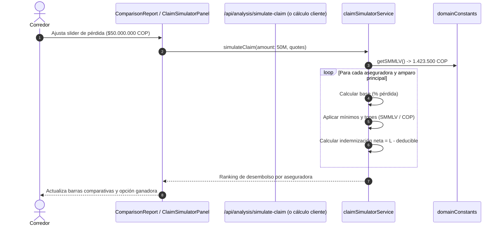

# Design: Simulador Interactivo de Deducibles y Auditoría Contable de Primas

## Architecture Overview

```
                      [QuoteProcessingService]
                                 │
                 ┌───────────────┴───────────────┐
                 ▼                               ▼
       [premiumExtractor.ts]          [hybridDeductibleParser.ts]
                 │                               │
                 ▼                               ▼
       [premiumAuditor.ts]           [claimSimulatorService.ts]
       (Verifica Neta+IVA=Tot)       (Calcula desembolso $L)
                 │                               │
                 └───────────────┬───────────────┘
                                 ▼
                     [ComparisonReport / UI]
                     [ClaimSimulatorPanel.tsx]
```

## Decisions & Rationale

### 1. Desacoplamiento de Servicios
* **Decisión:** Implementar `premiumAuditor.ts` y `claimSimulatorService.ts` como módulos puros y aislados en `server/src/services/`.
* **Razón:** No alterar el pipeline existente de `quoteProcessingService.ts` ni `matrixTransformer.ts`. Los nuevos servicios reciben estructuras ya existentes (`QuoteAnalysis.premium` y `CoverageItem.deductibleStructure`) y computan enriquecimientos suplementarios.

### 2. Resolución de Moneda y SMMLV Centralizada
* **Decisión:** Usar `server/src/config/domainConstants.ts` para obtener `SMMLV_VALUE` (por defecto $1.423.500 COP) y las utilidades de redondeo contable.
* **Razón:** Garantizar que el simulador y la auditoría sincronicen exactamente los mismos valores legales que utiliza el resto del sistema, evitando discrepancias de vigencia o cálculo.

### 3. Control Granular de Despliegue con Feature Flags
* **Decisión:** Incorporar `enablePremiumEquationAudit` y `enableClaimDeductibleSimulator` en `server/src/config/featureFlags.ts`.
* **Razón:** Permitir activación gradual y rollback instantáneo sin reiniciar la base de datos ni modificar registros históricos.

## Sequence Diagram: Simulación de Siniestro en Reporte


