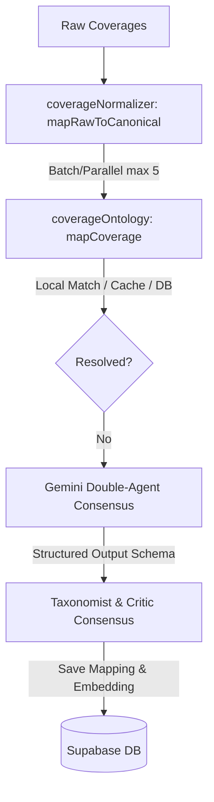

# Technical Design: Flexible Coverages and Groq Cleanup

## Technical Approach

1. **Dependency Cleanup**: Remove `groq` and `groq-sdk` dependencies from `package.json` and `package-lock.json`.
2. **Parallel Coverage Mapping**: Implement controlled concurrency in `coverageNormalizer.ts` for raw-to-canonical mappings using a custom Promise pool limiter (max 5 concurrent tasks).
3. **Ontology ID Alignment**: Modify `semanticMatcher.ts` to map string ontology IDs (e.g. `"incendio"`) to numeric taxonomy category IDs (e.g. `1`) using category names/aliases before evaluation. Keep categoryId `null` instead of defaulting to `0` if unmatched.
4. **Structured LLM Consensus**: In `coverageOntology.ts`, define strict JSON schemas (`TaxonomistResponseSchema` and `CriticResponseSchema`) using `@google/genai`'s `Type` and pass them as `responseSchema` with `responseMimeType: "application/json"` to enforce structured JSON consensus outputs.
5. **Optimized Learning Engine**: Refactor `getSimilarCorrections` in `learningEngine.ts` to retrieve pre-calculated vector embeddings from `coverage_mappings.embedding` column, computing similarity in-memory instead of generating embeddings in a loop. Fallback to a local Sørensen-Dice string similarity calculation if embeddings are unavailable. Ensure embeddings are generated and stored during `saveCorrection`.
6. **Dynamic Matrix Categories**: In `UnifiedCoverageMatrix.tsx`, load categories dynamically from `taxonomy.json` instead of hardcoding `CATEGORY_CONFIGS`.
7. **Semantic Exclusive Grouping**: Group unmapped coverages in `UnifiedCoverageMatrix.tsx` using `calculateSimilarity` with a threshold of `0.70` to consolidate minor insurer naming variations.

## Architecture Decisions

| Decision | Alternatives | Rationale |
|---|---|---|
| **Gemini Structured Outputs** | Free-text with regex parsing | Eliminates JSON parsing errors and ensures structural consistency. |
| **Local String Fallback** | Call external API / Levenshtein | Sørensen-Dice is fast, robust for typos/word-reordering, and runs entirely local. |
| **In-Memory Cosine Similarity** | Supabase PGVector RPC | Avoids complex database migrations or dependency on PGVector functions. |

## Data Flow



## File Changes

| Path | Action | Description |
|---|---|---|
| `package.json` | Modify | Remove `groq` and `groq-sdk` dependencies. |
| `server/src/services/coverageNormalizer.ts` | Modify | Implement concurrent mapping pool (limit 5) in `buildOntologyBasedCoverages`. |
| `server/src/services/semanticMatcher.ts` | Modify | Align category ID format (string to numeric) and remove default `0` fallback in `matchProbabilistic`. |
| `server/src/services/coverageOntology.ts` | Modify | Define structured output schemas and upgrade Gemini consensus calls to use `responseSchema`. |
| `server/src/services/learningEngine.ts` | Modify | Save embeddings on correction, retrieve pre-calculated embeddings, and implement local Sørensen-Dice fallback. |
| `components/UnifiedCoverageMatrix.tsx` | Modify | Load categories from `taxonomy.json` and group exclusive coverages semantically (threshold `0.70`). |

## Interfaces / Contracts

```typescript
// Taxonomist Schema
const TaxonomistResponseSchema = {
  type: Type.OBJECT,
  properties: {
    proposedGroupId: { type: Type.STRING },
    justification: { type: Type.STRING }
  },
  required: ["proposedGroupId", "justification"]
};

// Critic Schema
const CriticResponseSchema = {
  type: Type.OBJECT,
  properties: {
    approved: { type: Type.BOOLEAN },
    alternativeGroupId: { type: Type.STRING, nullable: true },
    reason: { type: Type.STRING }
  },
  required: ["approved", "alternativeGroupId", "reason"]
};
```

## Testing Strategy

1. **Unit Tests**:
   - `coverageNormalizer.test.ts`: Verify promise pool concurrent mapping (max 5) and correct handling.
   - `learningEngine.test.ts`: Test `getSimilarCorrections` using pre-calculated embeddings and Sørensen-Dice local fallback.
   - `semanticMatcher.test.ts`: Verify category ID alignment and check that it doesn't fallback to `0`.
   - `UnifiedCoverageMatrix.test.ts`: Mock `taxonomy.json` and verify dynamic category loading and semantic grouping.
2. **Integration Tests**:
   - Run end-to-end consensus flow to verify structured outputs with mock Gemini API key.

## Migration / Rollout

1. **Phase 1**: Update dependencies and run `npm install`.
2. **Phase 2**: Deploy backend service changes (`coverageNormalizer`, `learningEngine`, `coverageOntology`, `semanticMatcher`).
3. **Phase 3**: Deploy matrix components frontend update.

## Open Questions

1. Do we need custom threshold configurations for specific categories in semantic exclusive grouping? (Default is `0.70`).
