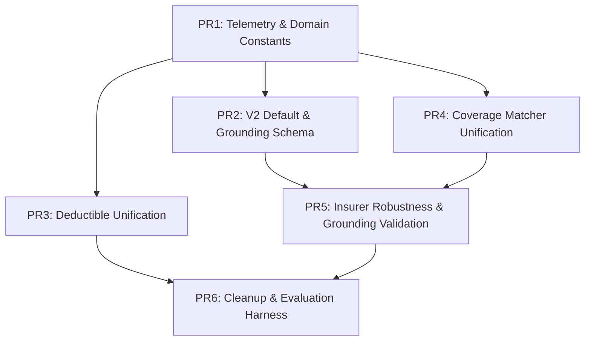

# SDD Tasks: Extraction Pipeline Improvements

## Document Control

| Field | Value |
|-------|-------|
| **Project** | comparadorpyme |
| **Change** | extraction-pipeline |
| **Phase** | sdd-tasks |
| **Mode** | Automatic — assumptions are stated explicitly. |
| **Artifact store** | openspec + engram (hybrid) |
| **Delivery strategy** | auto-chain, stacked-to-main |
| **Based on** | `proposal.md`, `spec.md`, `design.md`, `explore.md` |

---

## 1. Executive Summary

This change is delivered as **six independently mergeable, stacked PRs** that build on the extraction pipeline foundation:

1. **PR1 — Telemetry & Domain Constants (WP1)**
2. **PR2 — V2 Default & Grounding Schema (WP2 + WP6 schema)**
3. **PR3 — Deductible Unification (WP3)**
4. **PR4 — Coverage Normalization Unification (WP4)**
5. **PR5 — Insurer Robustness & Grounding Validation (WP5 + WP6 validation)**
6. **PR6 — Cleanup, Evaluation Harness & Zod Strictness**

**Estimated total effort:** 6–8 engineer-weeks (~30–40 focused dev-days).  
**Key assumption:** V2 multimodal is already more accurate than V1 and only needs hardening, observability, and consolidation of the normalization/deductible layers.

---

## 2. Review Workload Forecast

| Item | Value |
|------|-------|
| **Estimated changed lines (incl. tests/fixtures)** | ~2,500–3,500 across all slices |
| **Largest slices** | PR4 (matcher unification) and PR5 (insurer + grounding) — each ~600–900 lines |
| **Risk level** | **High** — touches the core extraction path, `analysisController.ts`, schema contracts, and downstream RAG/audit/scoring consumers |
| **Backwards compatibility critical?** | Yes — `/api/analyze` response shape and `ParsedQuote` downstream contracts must remain stable |
| **Chained PRs recommended** | **Yes** — scope spans multiple work packages and high-risk refactor areas |
| **Decision taken** | **auto-chain, stacked-to-main**: each PR is merged to `main` before the next slice begins |
| **PR size target** | Keep individual PRs under ~400 non-test changed lines where feasible; large refactors split into multiple commits inside the same slice |

---

## 3. Implementation Slices / PRs

### PR1 — Telemetry & Domain Constants (WP1)

**Goal:** Make extraction observable and remove hardcoded Colombian insurance domain constants. No extraction behavior changes.

**PR boundary (in / out):**
- **In:** `ExtractionMetrics` event type + emitter, `domainConstants.ts`, centralized canonical coverage list, taxonomy metadata alignment, Zod strictness gating, JSON-repair telemetry, and all consumer imports.
- **Out:** V2 default, prompt changes, deductible/parser/matcher refactors, grounding validation, UI changes.

**Files to create / modify / delete:**

| Action | Path | Notes |
|--------|------|-------|
| Create | `server/src/types/extractionMetrics.ts` | `ExtractionMetrics`, result/layer/source enums |
| Create | `server/src/services/extractionMetrics.ts` | Emitter + default JSON-lines sink |
| Create | `server/src/config/domainConstants.ts` | SMMLV/UVT resolver + canonical coverage loader |
| Create | `tests/server/extractionMetrics.test.ts` | Emitter unit tests |
| Create | `tests/server/domainConstants.test.ts` | Constants + resolver tests |
| Create | `tests/server/env-taxonomy-consistency.test.ts` | Env vs taxonomy metadata within 1% |
| Create | `tests/server/jsonRepair-telemetry.test.ts` | Repair category emission |
| Create | `tests/server/zod-strictness.test.ts` | `v1` strips, `v2` rejects unknown keys |
| Modify | `data/domains/pyme/taxonomy.json` | Update metadata values + source URL/date |
| Modify | `server/src/config/env.ts` | Consistency warning against taxonomy |
| Modify | `server/src/schemas/extractionSchemas.ts` | `ZOD_SCHEMA_VERSION` gating |
| Modify | `server/src/services/jsonRepair.ts` | `onRepairUsed(category)` callback |
| Modify | `server/src/controllers/analysisController.ts` | Create `quoteId`, pass emitter, emit final event |
| Modify | `server/src/services/quoteValidator.ts` | Use domain constants for premium range/canonical list |
| Modify | `server/src/services/quoteScorer.ts` | Use canonical list from `domainConstants.ts` |
| Modify | `server/src/services/clauseCoverageValidator.ts` | Use canonical list from `domainConstants.ts` |
| Modify | `server/src/services/inverseCoverageChecker.ts` | Use canonical list from `domainConstants.ts` |
| Modify | `server/src/services/insurerProfileService.ts` | Remove hardcoded `CANONICAL_COVERAGES` |
| Delete | N/A | No deletions |

**Step-by-step tasks (checklist):**

- [ ] Define `ExtractionMetrics`, `ExtractionResult`, `MatchLayer`, `InsurerDetectionSource`, `GroundingStatus` types.
- [ ] Implement `ExtractionMetricsEmitter` with in-process collection and optional sink.
- [ ] Create `domainConstants.ts` exporting `getDomainConstants(domain?)`, `getCanonicalCoverageNames(domain?)`, and `resolveValueToCOP(value, unit?)`.
- [ ] Update `taxonomy.json` metadata (`salaryValue2024`, `uvtValue2024`, `source`) to match authoritative env defaults.
- [ ] Add env-vs-taxonomy consistency check in `env.ts` startup path; warn if >1% drift.
- [ ] Replace hardcoded SMMLV/UVT values in `deductibleAnalyzer.ts`, `hybridDeductibleParser.ts`, `quoteValidator.ts`.
- [ ] Replace duplicated canonical coverage arrays in `quoteValidator.ts`, `quoteScorer.ts`, `clauseCoverageValidator.ts`, `inverseCoverageChecker.ts`, and frontend constants.
- [ ] Add `ZOD_SCHEMA_VERSION` gating in `extractionSchemas.ts`: `v1` removes `.passthrough()`, `v2` uses `.strict()` / `.catchall(z.never())`.
- [ ] Add `onRepairUsed(category)` callback to `jsonRepair.ts`; call it after every successful repair.
- [ ] Emit `extraction.started`, `extraction.native_text_ready`, `extraction.insurer_detected`, `extraction.format_detected`, `extraction.path_chosen`, `extraction.completed` from `analysisController.ts` / `quoteProcessingService.ts`.
- [ ] Write unit/integration tests for emitter, constants, consistency, repair telemetry, and Zod strictness.
- [ ] Run full test suite; grep for `1300000`, `1423500`, and canonical coverage literals to verify zero occurrences outside config/data.

**Dependencies:** None (foundation slice).

**Acceptance criteria / verification:**
- Every `/api/analyze` call emits at least one `ExtractionMetrics` event with `quoteId`, `index`, `total`, `result`.
- `grep -R "1300000\|1423500" server/src --include="*.ts"` returns only `env.ts` / `domainConstants.ts`.
- A grep for canonical coverage list literals returns only `taxonomy.json` and `domainConstants.ts`.
- All new and existing tests pass.

**Estimated effort:** 4–6 dev days.

**Rollback plan:** Revert the PR. Metrics events stop; constants revert to previous hardcoded values. No database or API contract changes.

---

### PR2 — V2 Default & Grounding Schema (WP2 + WP6 schema)

**Goal:** Make V2 multimodal the default extraction path for every non-scanned PDF and enforce `rawTextSnippet` / `pageNumber` in the V2 schema.

**PR boundary (in / out):**
- **In:** Path-selection logic, hardened V2 prompts, `QuoteExtractionSchemaV2` updates, `formatFamily` propagation, `quoteId`/`metrics` threading.
- **Out:** Grounding validation logic (PR5), evaluation harness (PR6), deductible/parser/matcher refactors.

**Files to create / modify / delete:**

| Action | Path | Notes |
|--------|------|-------|
| Modify | `server/src/config/featureFlags.ts` | Deprecate `ENABLE_MULTIMODAL_EXTRACTION` runtime opt-out behavior |
| Modify | `server/src/controllers/analysisController.ts` | Extract native text first; choose V2 vs legacy |
| Modify | `server/src/services/quoteProcessingService.ts` | Accept `quoteId`/`metrics`; populate `formatFamily` |
| Modify | `server/src/services/gemini.ts` | Require `rawTextSnippet`/`pageNumber`; add `formatFamily` |
| Modify | `server/src/schemas/extractionSchemas.ts` | Update `RawCoverageSchema` and `QuoteExtractionSchemaV2` |
| Modify | `server/src/services/promptBuilder.ts` | Append grounding + anti-hallucination block |
| Modify | `server/src/services/layoutAwarePromptBuilder.ts` | Append grounding + anti-hallucination block |
| Create | `tests/server/analysisController-path-selection.test.ts` | V2 default, scanned legacy, V2 failure fallback |
| Create | `tests/server/promptBuilder-grounding.test.ts` | Prompt clauses present |
| Create | `tests/server/gemini-schema-v2.test.ts` | Schema requires new fields |
| Create | `tests/server/quoteProcessingService-v2.test.ts` | Metrics + `formatFamily` propagation |
| Delete | N/A | No deletions |

**Step-by-step tasks (checklist):**

- [ ] Implement `shouldUseV2(file, nativeTextResult)`: returns `true` unless `ENABLE_MULTIMODAL_EXTRACTION === 'false'` or `isScanned === true`.
- [ ] Refactor `analysisController.ts` to call `pdfExtractor.extractTextFromPdf()` before path selection and pass `nativeTextResult` into `quoteProcessingService`.
- [ ] Update `ProcessQuoteOptions` to require `quoteId` and `metrics`.
- [ ] Update `quoteProcessingService.ts` to emit `extraction.path_chosen`, `extraction.v2.success`, `extraction.v2.repair`, `extraction.v2.raw_fallback`, `extraction.v2.legacy_fallback`.
- [ ] Add `formatFamily` to the V2 Gemini JSON schema and to the Zod `QuoteExtractionSchemaV2`.
- [ ] Make `rawTextSnippet` and `pageNumber` required in `RawCoverageSchema` for V2.
- [ ] Append the grounding and anti-hallucination prompt block to every V2 prompt template.
- [ ] Implement fallback ladder: V2 Zod parse error → retry up to 2× → JSON repair → raw extraction → legacy V1 → failed placeholder.
- [ ] Ensure each fallback step emits the correct `ExtractionMetrics` event.
- [ ] Add integration/unit tests for path selection, prompt content, schema shape, and metric propagation.

**Dependencies:** PR1 (metrics emitter, `quoteId`, constants).

**Acceptance criteria / verification:**
- Non-scanned PDFs use V2; scanned PDFs use legacy.
- V2 failure falls back to legacy and emits `extraction.v2.legacy_fallback`.
- V2 prompts contain the grounding and anti-hallucination clauses.
- `QuoteExtractionSchemaV2` rejects coverages missing `rawTextSnippet` or `pageNumber` when `ZOD_SCHEMA_VERSION=v2`.
- All tests pass.

**Estimated effort:** 5–7 dev days.

**Rollback plan:** Set `ENABLE_MULTIMODAL_EXTRACTION=false` (kept as emergency escape) or add a temporary guard clause in `quoteProcessingService.ts` forcing legacy. Revert schema requirement if prompt stability regresses.

---

### PR3 — Deductible Unification (WP3)

**Goal:** Replace scattered deductible regexes with a single structured parser (`hybridDeductibleParser.ts`) used by all downstream consumers.

**PR boundary (in / out):**
- **In:** Parser extension, `DeductibleStructure` schema expansion, consumer refactor, structured comparison in cross-reference/reconciliation.
- **Out:** Coverage matcher unification (PR4), grounding validation (PR5), evaluation harness (PR6).

**Files to create / modify / delete:**

| Action | Path | Notes |
|--------|------|-------|
| Modify | `server/src/schemas/extractionSchemas.ts` | Add `DeductibleComponentSchema`, `compoundOperator`, `rawText` |
| Modify | `server/src/services/hybridDeductibleParser.ts` | Canonical parser; compound detection; constants import |
| Create | `server/src/services/deductibleFormatter.ts` | Display formatting + equality helpers |
| Modify | `server/src/services/deductibleAnalyzer.ts` | Consume `DeductibleStructure` |
| Modify | `server/src/services/quoteValidator.ts` | Validate `DeductibleStructure` instead of regex |
| Modify | `server/src/services/thesaurusMapper.ts` | Remove deductible normalization regex |
| Modify | `server/src/services/crossReferenceEngine.ts` | Compare `DeductibleStructure` objects |
| Modify | `server/src/services/reconciliationService.ts` | Compare `DeductibleStructure` objects |
| Create | `tests/server/hybridDeductibleParser.test.ts` | Compound/reference/percentage/NA forms |
| Create | `tests/server/deductibleFormatter.test.ts` | Display + equality |
| Create | `tests/server/deductibleAnalyzer-integration.test.ts` | Analyzer uses parser output |
| Create | `tests/server/quoteValidator-deductible.test.ts` | Validation with structures |
| Create | `tests/server/crossReference-deductible.test.ts` | Structured discrepancy detection |
| Delete or deprecate | `server/src/services/deductibleParser.ts` | Proxy to `hybridDeductibleParser` or delete |

**Step-by-step tasks (checklist):**

- [ ] Extend `DeductibleStructure` schema with `components`, `compoundOperator`, `rawText`.
- [ ] Implement compound operator detection (`mayor entre`, `mayor de`, `menor entre`, `menor de`, `mín.`, `máx.`, `y`, `+`, `/`).
- [ ] Resolve SMMLV/UVT components to COP using `domainConstants.ts`.
- [ ] Compute `normalized.minAmountCOP`, `maxAmountCOP`, `percentage`, `isPercentageBased` for all forms.
- [ ] Add `parseMethod` (`cache` | `regex` | `llm` | `empty`) and `getStats()` / `resetStats()` to the parser.
- [ ] Create `deductibleFormatter.ts` with `formatDeductibleForDisplay()` and `deductibleEquals()`.
- [ ] Refactor `deductibleAnalyzer.ts` to accept `DeductibleStructure[]` and produce narrative/analysis.
- [ ] Refactor `quoteValidator.ts` deductible checks to use `DeductibleStructure`.
- [ ] Remove deductible regex from `thesaurusMapper.ts`.
- [ ] Update `crossReferenceEngine.ts` and `reconciliationService.ts` to use `deductibleEquals()`.
- [ ] Delete or mark `@deprecated` `deductibleParser.ts`; if kept, make it a thin proxy.
- [ ] Add unit/integration tests covering compound deductibles, SMMLV/UVT references, `NO APLICA`, malformed percentages, and cross-reference discrepancy detection.

**Dependencies:** PR1 (constants, metrics). Independent of PR2 but complements it.

**Acceptance criteria / verification:**
- `grep` for deductible regex patterns outside `hybridDeductibleParser.ts` returns only thin wrapper calls in `deductibleFormatter.ts`.
- All existing deductible tests pass; new compound/reference tests pass.
- Cross-reference engine no longer compares deductible strings directly.

**Estimated effort:** 5–7 dev days.

**Rollback plan:** Set `useLegacyDeductibleParser=true` (feature flag) or restore `deductibleParser.ts` from git if deleted. Consumers fall back to raw-string comparison temporarily.

---

### PR4 — Coverage Normalization Unification (WP4)

**Goal:** Consolidate `thesaurusMapper.ts`, `semanticMatcher.ts`, and `coverageNormalizer.ts` into a single `CoverageMatcher` service used by both V2 and legacy paths.

**PR boundary (in / out):**
- **In:** New `coverageMatcher/` module, matcher thresholds config, layer migration, batch optimization, metric emission.
- **Out:** Grounding validation (PR5), UI changes, evaluation harness (PR6).

**Files to create / modify / delete:**

| Action | Path | Notes |
|--------|------|-------|
| Create | `server/src/services/coverageMatcher/index.ts` | Public `CoverageMatcher` implementation |
| Create | `server/src/services/coverageMatcher/types.ts` | Interfaces + threshold types |
| Create | `server/src/services/coverageMatcher/thresholds.ts` | Default thresholds + env override |
| Create | `server/src/services/coverageMatcher/layers/thesaurusLayer.ts` | Exact/partial thesaurus match |
| Create | `server/src/services/coverageMatcher/layers/fuzzyLayer.ts` | Levenshtein match |
| Create | `server/src/services/coverageMatcher/layers/embeddingLayer.ts` | Batch embedding similarity |
| Create | `server/src/services/coverageMatcher/layers/llmLayer.ts` | Single-shot LLM classification |
| Create | `server/src/services/coverageMatcher/layers/graphLayer.ts` | Graph/ontology fallback |
| Create | `server/src/config/matcherThresholds.ts` | Central threshold values |
| Modify | `server/src/services/semanticMatcher.ts` | Deprecate public API; delegate to matcher |
| Modify | `server/src/services/thesaurusMapper.ts` | Deprecate public API; move thesaurus loading to layer |
| Modify | `server/src/services/coverageNormalizer.ts` | Coordinator only; call `coverageMatcher.normalizeBatch` |
| Modify | `server/src/services/learningEngine.ts` | Ensure correction format matches matcher cache |
| Create | `tests/server/coverageMatcher.test.ts` | Layer order + thresholds |
| Create | `tests/server/coverageMatcher-characterization.test.ts` | Same outputs as pre-refactor |
| Create | `tests/server/thesaurusLayer.test.ts` | Thesaurus exact/partial/fallback |
| Create | `tests/server/embeddingLayer.test.ts` | Cache hit + batching |
| Create | `tests/server/learningEngine-correction.test.ts` | Correction read back by matcher |
| Delete | N/A | No deletions in this slice |

**Step-by-step tasks (checklist):**

- [ ] Define `CoverageMatcherInput`, `CoverageMatcherResult`, and `CoverageMatcher` interface.
- [ ] Create `matcherThresholds.ts` with all layer thresholds and `needsReviewBelow`.
- [ ] Implement `thesaurusLayer.ts` using `taxonomy.json` aliases and built-in fallback thesaurus.
- [ ] Implement `fuzzyLayer.ts` with Levenshtein similarity against canonical names + synonyms.
- [ ] Migrate embedding batch logic into `embeddingLayer.ts`; preserve persistent cache reads/writes.
- [ ] Migrate LLM fallback into `llmLayer.ts` with the numbered canonical list prompt.
- [ ] Migrate graph/ontology fallback into `graphLayer.ts`, gated by `useTemplateGraphPipeline`.
- [ ] Implement `coverageMatcher.normalizeBatch()` with batch optimization: fast layers first, then embedding batch, then LLM batch, then graph.
- [ ] Populate `matcherLayerHits` and `normalizationConfidence` in `ExtractionMetrics`.
- [ ] Refactor `coverageNormalizer.ts` to call `coverageMatcher.normalizeBatch()` and keep only deductible resolution, insured-amount derivation, and implicit-coverage detection.
- [ ] Deprecate public methods in `semanticMatcher.ts` and `thesaurusMapper.ts`; make them thin wrappers that delegate to `coverageMatcher`.
- [ ] Verify `learningEngine.saveCorrection` writes `coverage_mappings` in the format expected by `embeddingLayer.ts`.
- [ ] Add characterization tests that assert identical canonical outputs for a representative fixture set before/after migration.

**Dependencies:** PR1 (constants, taxonomy, metrics). Independent of PR2/PR3 but can be stacked after them.

**Acceptance criteria / verification:**
- Only `coverageMatcher.normalizeBatch()` is invoked by both V2 and legacy paths.
- `ExtractionMetrics` includes per-layer hit counts and confidence distribution.
- Existing coverage normalization characterization tests pass without changing expected outputs.
- All tests pass.

**Estimated effort:** 6–8 dev days.

**Rollback plan:** Set `useLegacyCoverageMatcher=true` (feature flag) to bypass `coverageMatcher` and restore old public methods.

---

### PR5 — Insurer Robustness & Grounding Validation (WP5 + WP6 validation)

**Goal:** Detect insurer from PDF content and aliases, and validate every extracted value against native text with confidence penalties and UI indicators.

**PR boundary (in / out):**
- **In:** Insurer alias JSON/schema, ranked resolver, `groundingService.ts`, confidence penalty, `needsReview` flag, UI grounding indicators.
- **Out:** V2 default decision (PR2), deductible parser refactor (PR3), matcher unification (PR4).

**Files to create / modify / delete:**

| Action | Path | Notes |
|--------|------|-------|
| Create | `data/domains/insurerAliases.json` | Top Colombian insurer aliases, NITs, patterns |
| Create | `server/src/schemas/insurerAliasesSchema.ts` | Zod schema for alias file |
| Modify | `server/src/services/insurerProfileService.ts` | Ranked resolver: content → alias → filename |
| Modify | `server/src/controllers/analysisController.ts` | Use `InsurerResolutionResult` |
| Modify | `server/src/services/quoteProcessingService.ts` | Accept detection result instead of raw string |
| Create | `server/src/services/groundingService.ts` | `validateGrounding` / `validateGroundingBatch` |
| Modify | `server/src/services/valueValidationService.ts` | Integrate grounding results |
| Modify | `server/src/services/confidenceScorer.ts` | Apply grounding penalty |
| Modify | `server/src/services/quoteValidator.ts` | Set `needsReview` on grounding failure |
| Modify | `server/src/services/quoteParser.ts` | Carry `groundingStatus` on coverages |
| Modify | `types/analysis.ts` | Add optional `groundingStatus?: GroundingStatus` |
| Modify | `components/AuditDashboard.tsx` | Grounding indicator per coverage |
| Modify | `components/ComparisonReport.tsx` | Grounding indicator per coverage |
| Create | `tests/server/insurerProfileService.test.ts` | Content/alias/filename/generic fallback |
| Create | `tests/server/insurerAliasesSchema.test.ts` | Alias file validates |
| Create | `tests/server/analysisController-insurer.test.ts` | Generic filename + known content resolves |
| Create | `tests/server/groundingService.test.ts` | Snippet found/missing/page out of range |
| Create | `tests/server/confidenceScorer-grounding.test.ts` | Penalty math |
| Create | `tests/server/quoteProcessingService-grounding.test.ts` | V2 + legacy paths produce statuses |
| Create | `tests/components/AuditDashboard-grounding.test.tsx` | Icons render per status |
| Delete | N/A | No deletions |

**Step-by-step tasks (checklist):**

- [ ] Create `insurerAliases.json` covering at least Bolívar, SBS, MAPFRE, BBVA, and AXA/Chubb/HDI with aliases, NITs, content patterns, and filename patterns.
- [ ] Add Zod schema `InsurerAliasSchema` / `InsurerAliasesBundleSchema` and validate at startup.
- [ ] Implement `searchContentMatch(nativeText, metadata)` scanning first page, metadata, and known patterns across the document.
- [ ] Implement ranked resolver: content match → alias mapping → filename regex fallback → `GENERIC`.
- [ ] Update `analysisController.ts` and `quoteProcessingService.ts` to pass `InsurerResolutionResult` downstream.
- [ ] Emit `extraction.insurer_detected` with `source` and `confidence`.
- [ ] Create `groundingService.ts` with `validateGrounding()` and `validateGroundingBatch()`.
- [ ] Implement snippet search: exact substring, fuzzy token overlap (default 0.7), Levenshtein (default 0.75), cross-page fallback.
- [ ] Integrate grounding into `valueValidationService.ts`.
- [ ] Apply confidence penalties in `confidenceScorer.ts`: `-25` for `snippet_missing`, `-15` for `page_out_of_range`, `-10` for `native_text_unavailable`.
- [ ] Set `needsReview = true` in `quoteValidator.ts` for `snippet_missing` and `page_out_of_range`.
- [ ] Backfill V1 grounding fields by searching native text when possible.
- [ ] Add `groundingStatus` to `types/analysis.ts`, `quoteParser.ts`, and coverage rows.
- [ ] Add UI icons + tooltips in `AuditDashboard.tsx` and `ComparisonReport.tsx`.
- [ ] Add unit, integration, and component tests.

**Dependencies:** PR1 (metrics); PR2 (V2 schema with snippet/pageNumber); PR4 (canonical coverage shape carries grounding status).

**Acceptance criteria / verification:**
- A PDF named `quote.pdf` with known insurer content resolves to the correct insurer via content/alias.
- `ExtractionMetrics.insurerDetectionSource` is populated for every quote.
- Grounding validation runs for every quote and emits `extraction.grounding_checked`.
- Confidence is penalized according to the failure reason.
- UI shows ✅ / ⚠️ / ❌ indicators for each coverage.
- All tests pass.

**Estimated effort:** 6–8 dev days.

**Rollback plan:** Disable `ENABLE_DETERMINISTIC_GROUNDING=false` to stop validation/penalties while keeping schema/UI fields. Revert insurer resolver to filename-only if alias map causes mis-detection.

---

### PR6 — Cleanup, Evaluation Harness & Zod Strictness

**Goal:** Remove dead code, enable `ZOD_SCHEMA_VERSION=v2` by default, and add a lightweight per-format-family evaluation harness.

**PR boundary (in / out):**
- **In:** Dead-code deletion, feature-flag cleanup, strict Zod default, `evaluateFormatFamily.ts`, labeled fixtures, docs update.
- **Out:** OCR, controller refactor, golden-set CI framework.

**Files to create / modify / delete:**

| Action | Path | Notes |
|--------|------|-------|
| Delete | `server/src/services/deductibleParser.ts` | If still present after PR3 |
| Delete or simplify | `server/src/services/semanticMatcher.ts` | If reduced to empty wrapper |
| Delete or simplify | `server/src/services/thesaurusMapper.ts` | If reduced to empty wrapper |
| Modify | `server/src/config/featureFlags.ts` | Remove `ENABLE_MULTIMODAL_EXTRACTION` opt-out; default `ZOD_SCHEMA_VERSION=v2` |
| Modify | `server/src/schemas/extractionSchemas.ts` | Default strict mode |
| Create | `server/scripts/evaluateFormatFamily.ts` | Per-family evaluation harness |
| Create | `tests/fixtures/format-family/README.md` | Fixture labeling conventions |
| Create | `tests/fixtures/format-family/TABLE-DOUBLE/...` | ≥2 labeled PDFs |
| Create | `tests/fixtures/format-family/SECTIONS/...` | ≥2 labeled PDFs |
| Create | `tests/fixtures/format-family/DESCRIPTIVE/...` | ≥2 labeled PDFs |
| Create | `tests/fixtures/format-family/PRICE-TABLE/...` | ≥2 labeled PDFs |
| Create | `tests/server/evaluateFormatFamily.test.ts` | Harness integration test |
| Modify | `docs/golden-set-evaluation.md` or `README.md` | Document harness usage |

**Step-by-step tasks (checklist):**

- [ ] Delete `deductibleParser.ts` and any unused matcher wrapper files (confirm no callers remain).
- [ ] Remove or simplify `ENABLE_MULTIMODAL_EXTRACTION` runtime opt-out in `featureFlags.ts`; document that the flag is now ignored except for emergency `false`.
- [ ] Change default `ZOD_SCHEMA_VERSION` to `v2`.
- [ ] Update `extractionSchemas.ts` so strict mode is the default.
- [ ] Build `server/scripts/evaluateFormatFamily.ts` that loads fixtures, runs V2, compares canonical coverages, and prints a markdown report.
- [ ] Add labeled fixtures for the top 4 format families (at least 2 PDFs each with `expected.json`).
- [ ] Add an integration test that runs the harness on the fixture set.
- [ ] Update docs with harness usage, env vars, feature flags, and alias update process.
- [ ] Run full test suite and the evaluation harness; fix any strict-mode regressions.

**Dependencies:** PR1–PR5.

**Acceptance criteria / verification:**
- No references to deprecated `deductibleParser.ts` or redundant matcher implementations.
- `ZOD_SCHEMA_VERSION=v2` is the default; strict tests pass.
- `npm run evaluate:format-family` (or equivalent) runs and prints per-family accuracy/fallback/confidence.
- All tests pass.

**Estimated effort:** 4–6 dev days.

**Rollback plan:** Revert feature-flags default and restore deleted files from git if strict mode or cleanup causes regressions.

---

## 4. Cross-Cutting Concerns

### Testing
- Add **unit tests** for every new module (`extractionMetrics`, `domainConstants`, `hybridDeductibleParser`, `deductibleFormatter`, `coverageMatcher` layers, `groundingService`, `insurerProfileService`).
- Add **integration tests** for controller path selection, quote processing service (V2/legacy), cross-reference deductible comparison, and learning-engine correction feedback.
- Add **characterization tests** before changing `semanticMatcher.ts` / `thesaurusMapper.ts` / `coverageNormalizer.ts` to lock current outputs.
- Add **component tests** for `AuditDashboard.tsx` and `ComparisonReport.tsx` grounding indicators.
- Use the existing Vitest/Jest setup; mock Gemini and Redis where needed.

### Observability
- Use `ExtractionMetrics` as the single structured event per quote.
- Emit intermediate stage events via the existing `structuredLogger` (`extraction.started`, `extraction.completed`, `deductible.parsed`, `coverage_match_layer`, `grounding_passed`, `insurer_resolved`, etc.).
- Aggregate by `extractionPath`, `outcome`, `formatFamily`, `insurerDetectionSource`, `normalizationLayerHits`, `groundingFailures`, and `deductibleParseFailures`.
- Ensure metrics contain **no PII** — no filenames, user IDs, or full PDF text.

### Documentation
- Update `README.md` or `docs/golden-set-evaluation.md` with the evaluation harness command and fixture labeling convention.
- Document new env vars (`ZOD_SCHEMA_VERSION`, `ENABLE_DETERMINISTIC_GROUNDING`, `SMMLV_VALUE`, `UVT_VALUE`) and feature flags.
- Document the insurer alias update process and the canonical coverage taxonomy source.

### Feature Flags

| Flag | Default after PR6 | Purpose |
|------|-------------------|---------|
| `ENABLE_MULTIMODAL_EXTRACTION` | Ignored (V2 default) | Emergency `false` forces legacy |
| `ZOD_SCHEMA_VERSION` | `v2` | `v1` strips unknown keys; `v2` rejects them |
| `ENABLE_DETERMINISTIC_GROUNDING` | `true` | Toggle grounding validation/penalty |
| `useLegacyCoverageMatcher` | `false` | Emergency rollback to old matcher |
| `useLegacyDeductibleParser` | `false` | Emergency rollback to old deductible path |
| `useTemplateGraphPipeline` | `false` | Graph/ontology fallback layer |
| `semanticCoverageOntology` | `true` | Existing ontology grouping |

### Backwards Compatibility
- `/api/analyze` response shape remains unchanged; new fields (`groundingStatus`, `detectedInsurerSource`, `formatFamily`) are optional.
- `ParsedQuote` downstream consumers (RAG, audit, clause reconciliation, scoring, learning engine) continue to receive the same shape.
- Database schema is unchanged.
- Legacy V1 path is preserved as a degraded fallback.

---

## 5. Task Dependency Graph

*PR2, PR3, and PR4 can be developed in parallel once PR1 lands; the stacked-to-main strategy serializes merges in the order shown.*

---

## 6. Risk-Driven Ordering

1. **PR1 first** — telemetry and constants are prerequisites for measuring every subsequent slice. Without metrics, we cannot verify targets.
2. **PR2 next** — making V2 the default is the highest-impact product change and the schema grounding fields are required before validation can run.
3. **PR3 then PR4** — deductible unification and matcher unification are independent but PR4’s normalization coordinator consumes parsed deductible structures; ordering them this way reduces integration churn.
4. **PR5 after PR2 + PR4** — grounding validation needs V2’s `rawTextSnippet`/`pageNumber` and the unified canonical coverage shape.
5. **PR6 last** — cleanup and strict-mode enablement are only safe after all functional slices are proven stable.

---

## 7. Definition of Done

- [ ] All 6 PRs are merged to `main` via stacked-to-main auto-chain.
- [ ] No hardcoded SMMLV/UVT values or canonical coverage literals remain outside `domainConstants.ts` / `taxonomy.json`.
- [ ] V2 multimodal is the default for every non-scanned PDF; legacy path is invoked only for scanned PDFs or V2 failures.
- [ ] Every `/api/analyze` quote emits a complete `ExtractionMetrics` event.
- [ ] `hybridDeductibleParser.ts` is the single deductible parser; `deductibleParser.ts` is removed.
- [ ] `coverageMatcher/` is the single coverage normalization path for both V2 and legacy.
- [ ] Insurer detection resolves from PDF content/aliases with filename as fallback.
- [ ] Grounding validation runs per quote, penalizes confidence, and surfaces status in the UI.
- [ ] `ZOD_SCHEMA_VERSION=v2` is the default and strict mode passes all tests.
- [ ] `evaluateFormatFamily.ts` runs against at least 2 fixtures per top-4 format family and prints a report.
- [ ] All unit, integration, and component tests pass; no regression in existing RAG/audit/scoring flows.
- [ ] Documentation is updated with new flags, env vars, alias process, and harness usage.

---

## 8. Appendix: File Change Matrix

| File | Slices | Action | Notes |
|------|--------|--------|-------|
| `server/src/types/extractionMetrics.ts` | PR1 | Create | Event + enum types |
| `server/src/services/extractionMetrics.ts` | PR1 | Create | Emitter + sink |
| `server/src/config/domainConstants.ts` | PR1 | Create | Central constants/resolver |
| `data/domains/pyme/taxonomy.json` | PR1, PR4 | Modify | Metadata + canonical categories |
| `server/src/config/env.ts` | PR1 | Modify | Consistency check |
| `server/src/schemas/extractionSchemas.ts` | PR1, PR2, PR3, PR6 | Modify | Zod strictness, V2 schema, deductible structure |
| `server/src/services/jsonRepair.ts` | PR1 | Modify | Repair telemetry callback |
| `server/src/controllers/analysisController.ts` | PR1, PR2, PR5 | Modify | Quote ID, path selection, insurer result |
| `server/src/services/quoteProcessingService.ts` | PR2, PR5 | Modify | QuoteId/metrics, formatFamily, insurer result |
| `server/src/services/gemini.ts` | PR2 | Modify | V2 schema additions |
| `server/src/services/promptBuilder.ts` | PR2 | Modify | Grounding/anti-hallucination block |
| `server/src/services/layoutAwarePromptBuilder.ts` | PR2 | Modify | Grounding/anti-hallucination block |
| `server/src/config/featureFlags.ts` | PR2, PR6 | Modify | Deprecate multimodal flag, default strict Zod |
| `server/src/services/hybridDeductibleParser.ts` | PR1, PR3 | Modify | Canonical parser, constants import |
| `server/src/services/deductibleFormatter.ts` | PR3 | Create | Display + equality helpers |
| `server/src/services/deductibleAnalyzer.ts` | PR1, PR3 | Modify | Use structured parser |
| `server/src/services/quoteValidator.ts` | PR1, PR3, PR5 | Modify | Constants, deductible validation, grounding needsReview |
| `server/src/services/thesaurusMapper.ts` | PR3, PR4 | Modify/Deprecate | Remove deductible regex, delegate matcher |
| `server/src/services/deductibleParser.ts` | PR3, PR6 | Delete | Superseded by hybrid parser |
| `server/src/services/crossReferenceEngine.ts` | PR3 | Modify | Structured deductible comparison |
| `server/src/services/reconciliationService.ts` | PR3 | Modify | Structured deductible comparison |
| `server/src/services/coverageMatcher/` | PR4 | Create | Unified matcher module + layers |
| `server/src/config/matcherThresholds.ts` | PR4 | Create | Threshold config |
| `server/src/services/semanticMatcher.ts` | PR4 | Modify/Deprecate | Delegate to coverageMatcher |
| `server/src/services/coverageNormalizer.ts` | PR4 | Modify | Coordinator only |
| `server/src/services/learningEngine.ts` | PR4 | Modify | Correction cache format |
| `data/domains/insurerAliases.json` | PR5 | Create | Insurer alias mapping |
| `server/src/schemas/insurerAliasesSchema.ts` | PR5 | Create | Alias file Zod schema |
| `server/src/services/insurerProfileService.ts` | PR1, PR5 | Modify | Ranked resolver |
| `server/src/services/groundingService.ts` | PR5 | Create | Snippet/page validation |
| `server/src/services/valueValidationService.ts` | PR5 | Modify | Integrate grounding |
| `server/src/services/confidenceScorer.ts` | PR5 | Modify | Grounding penalty |
| `server/src/services/quoteParser.ts` | PR5 | Modify | Carry groundingStatus |
| `types/analysis.ts` | PR5 | Modify | Add `groundingStatus` |
| `components/AuditDashboard.tsx` | PR5 | Modify | Grounding indicator |
| `components/ComparisonReport.tsx` | PR5 | Modify | Grounding indicator |
| `server/scripts/evaluateFormatFamily.ts` | PR6 | Create | Evaluation harness |
| `tests/fixtures/format-family/` | PR6 | Create | Labeled PDF fixtures |
| `docs/golden-set-evaluation.md` / `README.md` | PR6 | Modify | Harness + flag docs |

---

*Tasks generated during SDD Tasks phase for project `comparadorpyme`.*
