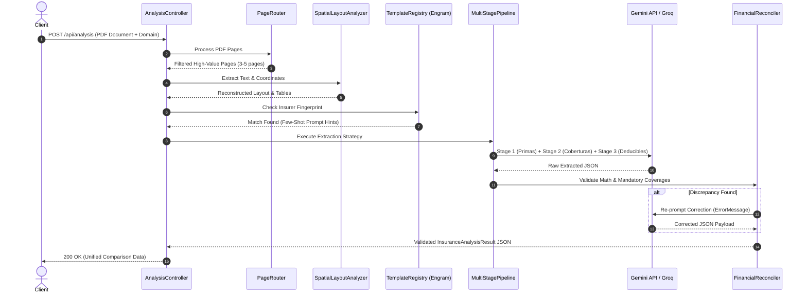

## Context

El sistema de comparación unificada actualmente utiliza el patrón `PromptStrategy` (`server/src/services/unifiedComparison/`) para generar prompts por ramo y formato. Sin embargo, cuando las aseguradoras colombianas emplean distribuciones complejas (ej. tablas divididas en 2 páginas, anexos en páginas 20+, o tipografías irregulares), la tasa de extracción completa de deducibles y desgloses de primas disminuye.

Este diseño técnico establece la arquitectura para el pipeline multi-plantilla de 5 niveles que integra detección de layout, filtrado de páginas, fingerprinting de aseguradoras, extracción multi-paso y validación determinística.

## Goals / Non-Goals

**Goals:**
- Incrementar la precisión de extracción de deducibles y coberturas en documentos multi-página complejos.
- Reducir el tamaño del prompt enviando solo páginas relevantes mediante el `PageRouter`.
- Integrar la memoria de plantillas con `Engram` y el orquestador `Gentle AI`.
- Validar matemáticamente los totales financieros antes de entregar la respuesta al cliente/backend.

**Non-Goals:**
- No se modifica la API REST pública ni el contrato `InsuranceAnalysisResult`.
- No se reemplaza el motor Gemini API / Groq; se optimiza la estructuración previa y posterior de las peticiones.

## Decisions

### 1. Pre-procesamiento y Análisis de Layout (Spatial Layout Analyzer)
- **Decisión**: Implementar un analizador de coordenadas de texto en PDF (`pdfjs-dist` / layout-aware parser) que reconstruye filas de tablas basándose en alineación vertical ($Y$) y horizontal ($X$).
- **Alternativas consideradas**: Enviar texto plano sin coordenadas (actual, propenso a desalinear deducibles en tablas dobles).

### 2. Enrutador Temático de Páginas (Page Router & Chunking)
- **Decisión**: Escanear los títulos de las páginas antes de enviarlas al LLM. Si un documento supera las 5 páginas, seleccionar solo las páginas marcadas como `SUMMARY`, `COVERAGE_SCHEDULE`, `DEDUCTIBLE_TERMS` o `PREMIUM_BREAKDOWN`.
- **Alternativas consideradas**: Enviar el PDF completo (satura la ventana de contexto y aumenta costos).

### 3. Registro de Plantillas y Fingerprinting (Template Registry + Engram)
- **Decisión**: Utilizar `templateRegistrySchema` extendido con persistencia en Engram para recordar huellas digitales por aseguradora (Sura, AXA, Mapfre, SBS, Bolívar).
- **Alternativas consideradas**: Prompts genéricos sin ejemplos *few-shot*.

### 4. Pipeline de Extracción Multi-Paso (Multi-Stage Pipeline)
- **Decisión**: Dividir la llamada al LLM en 3 micro-pasos cuando el documento sea clasificado como `COMPLEX`:
  1. `Stage 1`: Datos básicos, vehículo/edificio/contrato y prima total.
  2. `Stage 2`: Coberturas brutas (`rawCoverages`).
  3. `Stage 3`: Deducibles, copagos y cumplimiento normativo.
- **Alternativas consideradas**: Extracción en un único paso masivo.

### 5. Reconciliador Determinístico y Autocorrección Financial
- **Decisión**: Ejecutar una función puramente matemática en Node.js tras la extracción: si `Math.abs((netPremium + taxes + fees) - totalPayable) > 1`, solicitar una corrección focalizada (`buildCorrectionPrompt`).
- **Alternativas consideradas**: Confiar ciegamente en la suma generada por el LLM.

## Architecture & Sequence Diagram

## Risks / Trade-offs

- **[Riesgo 1]**: Un PDF escaneado con OCR deficiente puede dificultar el cálculo de coordenadas $X,Y$.
  - *Mitigación*: Fallback automático a parser descriptivo sin coordenadas cuando el nivel de confianza de OCR sea bajo.
- **[Riesgo 2]**: Múltiples llamadas en el pipeline multi-paso aumentan la latencia total.
  - *Mitigación*: Ejecutar etapas independientes en paralelo cuando el documento no presente dependencias cruzadas.

## Migration Plan

1. Implementar `PageRouter` y `SpatialLayoutAnalyzer` como módulos de servicios sin romper los controladores existentes.
2. Integrar las reglas en `promptStrategyFactory` con compatibilidad hacia atrás.
3. Desplegar mediante integración continua verificando los 35 tests unitarios existentes.
