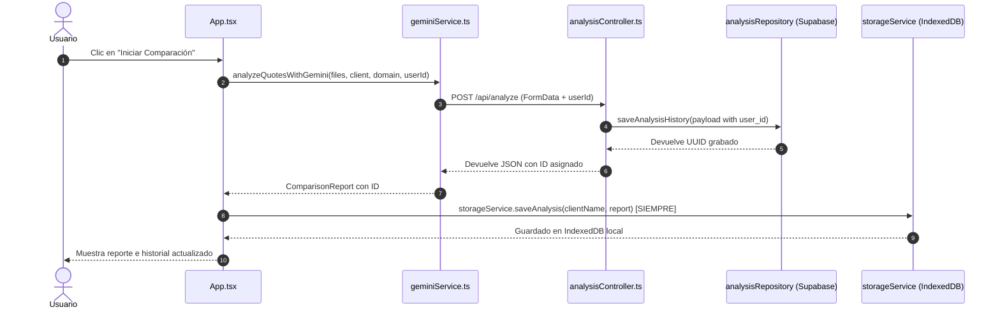

# Design: Persistencia Universal de Historial de Comparaciones

## Component & Service Changes



### 1. `services/geminiService.ts`
- Agregar parámetro opcional `userId?: string`.
- Si `userId` está presente, enviarlo en `formData.append('userId', userId)`.

### 2. `server/src/controllers/analysisController.ts`
- Actualizar `resolveAnalysisUserId(req)`:
  ```ts
  export function resolveAnalysisUserId(req: AuthenticatedRequest): string {
    return req.user?.id || (req.body?.userId as string) || 'anonymous';
  }
  ```

### 3. `App.tsx`
- Pasar `currentUser?.id` al invocar `analyzeQuotesWithGemini`.
- Llamar incondicionalmente a `storageService.saveAnalysis(clientName, result, selectedClient?.id)`.

### 4. `services/storageService.ts`
- En `saveAnalysis`, usar `currentUser?.id || 'guest'` para que nunca se aborte la persistencia local.
