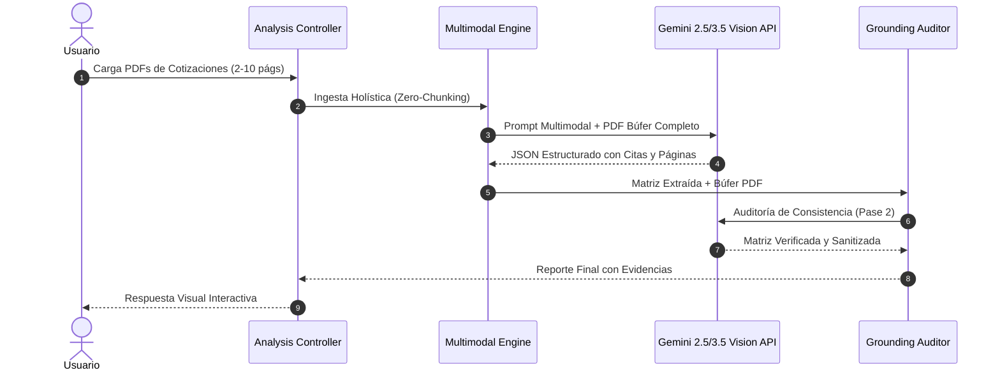

# Design: Tubería de Análisis Multimodal Holístico (Zero-Chunking & Two-Pass Grounding)

## Architecture Overview



## Detailed Technical Changes

### 1. Extensión del Esquema de Coberturas (`server/src/types/unifiedComparison.ts` & `types.ts`)
- Extender la interfaz de cada cobertura extraída con metadatos de evidencia:
  ```ts
  export interface GroundedCoverageValue {
    name: string;
    canonicalName?: string;
    value: string;
    numericValue?: number | null;
    deductibleText: string;
    numericDeductible?: number | null;
    pageNumber: number;
    sourceSnippet: string;
    confidenceScore: number;
    section?: string;
  }
  ```

### 2. Prompting Nativo Multimodal (`server/src/services/unifiedComparison/comparisonPromptBuilder.ts`)
- Reestructurar el prompt para exigir la extracción completa en una sola llamada visión:
  - Preservar la relación entre columnas de coberturas y notas al pie de deducibles.
  - Formatear automáticamente los números sin perder separadores de miles/decimales.
  - Extraer explícitamente el número de página de cada condición.

### 3. Motor de Auditoría y Verificación en 2 Pasos (`server/src/services/quoteValidator.ts` / `groundingAuditor.ts`)
- Implementar `auditGroundedResult(result, pdfBuffers)`:
  - Compara la lista de deducibles generales con las coberturas individuales.
  - Detecta inconsistencias como primas anuales inferiores a la prima mensual o deducibles no asociados a su amparo correspondiente.
